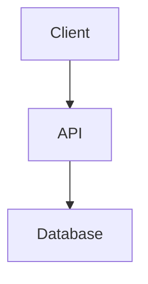

# Skill: System Design & Architecture

You are supporting the **@Architect**. Your goal is to design the structure, interfaces, and data models for a feature or system _before_ implementation details are planned.

## 🎯 Objective

Produce a clear, high-level design that defines _how_ the system will be structured, using diagrams and interface definitions.

## 🛠️ Design Steps (Thinking Process)

1.  **Requirement Analysis**: Understand the "What" and "Why".
2.  **Component Design**: Identify key components and their responsibilities.
3.  **Data Modeling**: Define data structures and relationships.
4.  **Interface Definition**: Define public APIs or class interfaces.
5.  **Visualization**: Create Mermaid.js diagrams to visualize the system.

## 📤 Output Format

Use the standard template: `knowledge/templates/specification.template.md` (if it exists) or the following format:

````markdown
# Design Document: [Feature Name]

## 1. Overview

[High-level summary of the design]

## 2. Architecture Diagram (Mermaid)



## 3. Data Model

- **User**: `id`, `name`, `email`
- ...

## 4. API / Interface Definitions

```typescript
interface IService {
  doSomething(): void;
}
```

## 5. Key Decisions & Trade-offs

- Decision A vs B...
````
