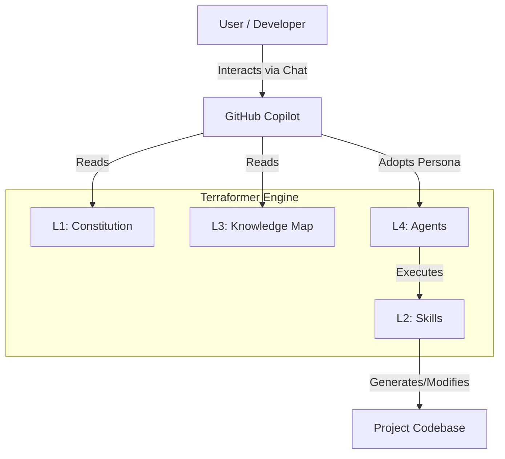

<!-- This document is generated/updated by the sync-doc workflow -->

# Architecture Overview

## System Overview

Terraformer is a **Meta-Engine** that implements the **AI-Native Transformation Protocol (ANTP v1.4)**. Its purpose is to transform legacy "human-only" software projects into "AI-Ready" ecosystems. It achieves this not by adding runtime code to the application, but by injecting a configuration layer (Context, Agents, Skills) that enables GitHub Copilot to function as a specialized team of agents.

## Key Components

The system is built on the **Roles & Skills Architecture**, consisting of four layers:

1.  **L1: Constitution** (`AGENTS.md`)

    - Defines immutable rules and behavioral guardrails for all agents.
    - Ensures safety and alignment with the project's core philosophy.

2.  **L2: Skills** (`.github/prompts/*.prompt.md`)

    - Standardized Operating Procedures (SOPs) encapsulated as prompt files.
    - Executable by agents to perform specific tasks (e.g., `/plan`, `/refactor`, `/test`).

3.  **L3: Knowledge** (`agents-docs/*`)

    - A high-density context map of the project.
    - Serves as the "shared brain" for all agents, providing architectural context, tech stack details, and domain knowledge.

4.  **L4: Agents** (`.github/agents/*.agent.md`)
    - Specialized personas with defined roles, authorities, and constraints.
    - Examples: `@Architect` (Design), `@Developer` (Implementation), `@QualityGuard` (Review).

## Architecture Diagram

## Data Flow

1.  **Context Loading**: When a user invokes an agent (e.g., `@Architect`), Copilot loads the agent definition (L4), the Constitution (L1), and the Knowledge Map (L3).
2.  **Skill Execution**: The agent may invoke a skill (e.g., `/plan`). Copilot loads the corresponding prompt file (L2).
3.  **Generation**: The agent generates a response or code modification based on the combined context of L1-L4 and the user's request.
4.  **Context Update**: Changes to the codebase or documentation are reflected in the project, which effectively updates the "Knowledge" for future interactions (especially if `AGENTS.md` is updated).

## Design Background and Rationale

- **Context Debt**: Legacy projects lack the explicit context AI needs. Terraformer bridges this gap.
- **Anti-Generalist Principle**: Generic AI assistants often fail due to lack of constraints. Specialized agents with defined roles (e.g., `@Developer` cannot change specs) prevent "Specification Drift" and ensure higher quality.
- **No-Code Runtime**: By leveraging the existing GitHub Copilot infrastructure, Terraformer avoids the need for complex local runtime environments or external API dependencies.
