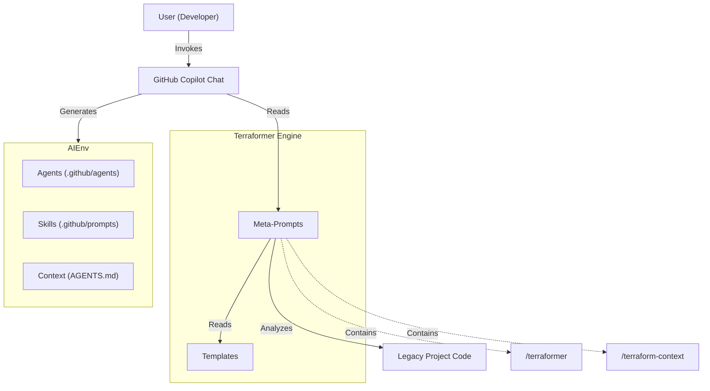

<!-- This document is generated/updated by the sync-doc workflow -->

# Architecture Overview

## System Overview

**Terraformer** is a **Meta-Engine** implementation of the **AI-Native Transformation Protocol (ANTP v1.4)**. Its purpose is to transform legacy "human-only" software projects into "AI-Ready" ecosystems.

Unlike traditional software, Terraformer does not have a compiled runtime binary. Instead, it operates as a set of **Prompt Definitions** and **Templates** that run within the **GitHub Copilot** environment in VS Code. It acts as a "Configuration Generator" that analyzes a project's codebase and produces a specialized team of AI Agents and Standard Operating Procedures (Skills).

## Key Components

The system is built upon the **Roles & Skills Architecture** (ANTP), consisting of four layers:

1.  **L1: Constitution (`AGENTS.md`)**

    - The immutable core rules and context map of the project.
    - Defines the "Context Debt" to be eliminated.
    - Acts as the single source of truth for all agents.

2.  **L2: Skills (`.github/prompts/*.prompt.md`)**

    - Standardized Operating Procedures (SOPs) encapsulated as prompt files.
    - Executable capabilities that agents (or users) can invoke (e.g., `/plan`, `/refactor`).
    - In Terraformer's source, these exist as **Templates** in `.github/templates/skills/`.

3.  **L3: Knowledge (`agents-docs/*`)**

    - Explicit, structured documentation designed for AI consumption.
    - Covers architecture, directory structure, flows, and conventions.

4.  **L4: Agents (`.github/agents/*.agent.md`)**
    - Specialized personas with defined roles, authorities, and constraints.
    - In Terraformer's source, these exist as **Templates** in `.github/templates/*.agent.template.md`.

## Architecture Diagram

## Data Flow

1.  **Initialization**: User invokes `/terraform-context`.
    - Engine analyzes project structure.
    - Generates `AGENTS.md` (L1).
2.  **Generation**: User invokes `/terraformer`.
    - Engine reads `AGENTS.md` and Project Code.
    - Engine selects appropriate Templates.
    - Engine generates `.github/agents/*` and `.github/prompts/*`.
3.  **Operation**: User interacts with generated Agents (e.g., `@Architect`).
    - Agent reads `AGENTS.md` and `agents-docs/`.
    - Agent executes Skills (e.g., `/plan`).

## Design Background and Rationale

- **Zero-Install**: Leverages existing VS Code + Copilot infrastructure. No npm/pip packages to install.
- **Text-as-Software**: The entire logic is defined in Markdown/Prompts, making it easy to inspect and modify.
- **Context-First**: Prioritizes the creation of `AGENTS.md` to solve the "Context Debt" problem which is the primary cause of AI hallucinations in large projects.
