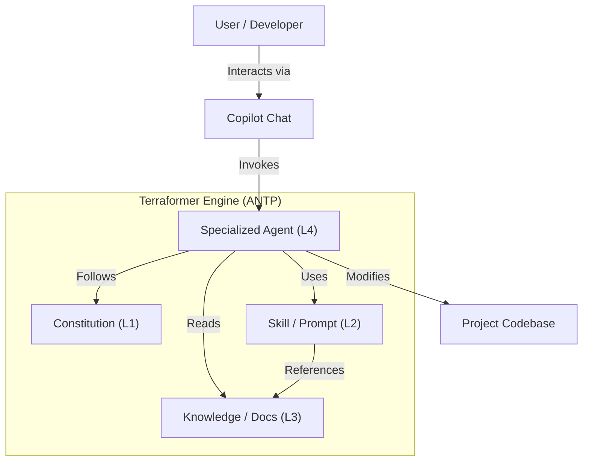

<!-- This document is generated/updated by the sync-doc workflow -->

# Architecture Overview

## System Overview

**Terraformer** is a Meta-Engine and reference implementation of the **AI-Native Transformation Protocol (ANTP)**.
Its primary purpose is to transform existing "human-centric" software projects into **AI-Native ecosystems** where humans and AI agents can collaborate seamlessly.

Unlike typical AI coding assistants that simply autocomplete code, Terraformer operates as a **configuration engine**. It analyzes the target project and generates a "Context Map" and a specialized "AI Team" (Agents and Skills) tailored to that project. This eliminates "Context Debt"—the invisible knowledge gap that causes AI to hallucinate or drift from specifications.

## Key Components

The system is built upon the **Roles & Skills Architecture** (ANTP v1.4), comprising four distinct layers:

### L1: Constitution (Immutable Rules)

- **Role**: Defines the fundamental laws and operating principles of the AI agents.
- **Key Artifact**: `AGENTS.md`
- **Responsibility**: ensuring all agents adhere to the "Anti-Generalist Principle" and respect role boundaries.

### L2: Skills (Standard Operating Procedures)

- **Role**: Provides agents with specific, executable capabilities.
- **Key Artifacts**: `.github/prompts/*.prompt.md`
- **Responsibility**: Enabling agents to perform complex tasks like "Refactoring", "Planning", or "Auditing" using standardized, best-practice workflows.

### L3: Knowledge (Explicit Context Map)

- **Role**: Acts as the external long-term memory for the project.
- **Key Artifacts**: `agents-docs/`, `knowledge/`
- **Responsibility**: Storing architectural decisions, coding conventions, domain terminology, and guidelines that are too voluminous to fit in a single prompt context but essential for high-quality output.

### L4: Agents (Specialized Roles)

- **Role**: The active participants that execute tasks.
- **Key Artifacts**: `.github/agents/*.agent.md` (implied/generated via Copilot Custom Agents or templates)
- **Responsibility**: Each agent (e.g., `@Architect`, `@Developer`) has a specific scope of authority and a defined set of allowed skills.

## Architecture Diagram

## Data Flow

1.  **Context Injection**: When a user invokes an agent (e.g., `@Architect`), the `AGENTS.md` (L1) is loaded into the context.
2.  **Instruction Execution**: The agent receives the user's prompt and selects the appropriate Skill (L2) (e.g., `/plan`).
3.  **Knowledge Retrieval**: The skill may reference specific documents in `agents-docs` or `knowledge` (L3) to ground its response in the project's actual standards.
4.  **Output Generation**: The agent generates a response (code, plan, or answer) that is strictly aligned with the retrieved context.

## Design Background and Rationale

The primary design philosophy is the **Anti-Generalist Principle**.
Generic AI models fail at complex software engineering tasks because they lack "context" and "accountability".

Terraformer addresses this by:

1.  **Specialization**: Splitting the "AI" into distinct roles (Planning vs. Implementation vs. OA).
2.  **Explicit Context**: Forcing implicit knowledge (formatting rules, architectural patterns) into explicit documentation that the AI _must_ read.
3.  **Strict Boundaries**: Preventing implementation agents (`@Developer`) from making design decisions, mirroring a healthy human engineering team structure.
