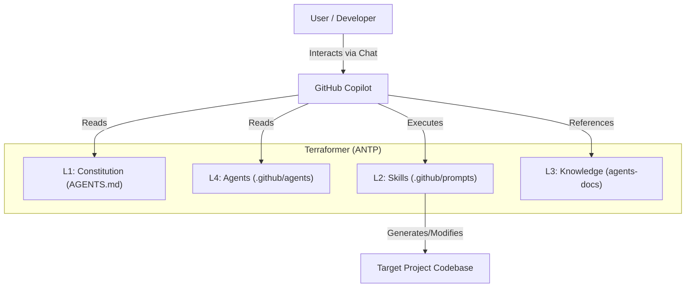

<!-- This document is generated/updated by the sync-doc workflow -->

# Architecture Overview

## System Overview

Terraformer is a meta-engine and reference implementation of the **AI-Native Transformation Protocol (ANTP)**. Its primary purpose is to transform legacy "human-only" software projects into "AI-Ready" environments. It achieves this not by adding runtime code, but by injecting a structured configuration layer that enables GitHub Copilot to function as a specialized team of AI agents.

## Key Components

The system is built upon the **Roles & Skills Architecture**, consisting of four distinct layers:

1.  **L1: Constitution (Immutable Rules)**

    - **File**: `AGENTS.md`
    - **Responsibility**: Defines the high-level rules, agent roles, and authority boundaries (e.g., the "Anti-Generalist Principle").

2.  **L2: Skills (Standard Operating Procedures)**

    - **Files**: `.github/prompts/*.prompt.md`
    - **Responsibility**: Provides reusable, standardized instructions (SOPs) for specific tasks like planning, refactoring, and testing.

3.  **L3: Knowledge (Explicit Context Map)**

    - **Files**: `agents-docs/*`
    - **Responsibility**: Stores detailed, AI-consumable documentation about the project's architecture, directory structure, and conventions.

4.  **L4: Agents (Specialized Roles)**
    - **Files**: `.github/agents/*.agent.md` (conceptually defined in `AGENTS.md`)
    - **Responsibility**: Defines the persona, authority, and constraints for specific AI roles (e.g., `@Architect`, `@Developer`).

## Architecture Diagram

## Data Flow

1.  **Initialization**: The user installs Terraformer (copies `.github` folder).
2.  **Context Generation**: User runs `/terraform-context` to generate `AGENTS.md` (L1 & L3 summary).
3.  **Agent Activation**: User invokes an agent (e.g., `@Architect`) in Copilot Chat.
4.  **Skill Execution**: The agent executes a skill (e.g., `/plan`).
5.  **Output**: Copilot generates code, plans, or documentation based on the definitions and context.

## Design Background and Rationale

**The Problem: Context Debt**
Traditional projects rely on implicit knowledge that AI cannot access. This leads to hallucinations, specification drift, and low-quality code when using generic AI assistants.

**The Solution: Explicit Context**
Terraformer solves this by making context explicit and structured. By defining roles and skills as code (configuration), it ensures that AI agents operate within safe boundaries and follow established patterns, effectively treating the development process itself as a programmable entity.
