<!-- This document is generated and updated by .github/prompts/document-project.prompt.md -->

# Architecture Overview

## System Overview

**Terraformer** is a **Meta-Engine** that transforms legacy codebases into AI-Native environments. It implements the AI-Native Transformation Protocol (ANTP v1.4) and automatically generates specialized AI agents and skills (SOPs: Standard Operating Procedures) tailored to target projects.

### Core Concept: Context Debt

Traditional projects rely on implicit knowledge (Tribal Knowledge). When generic AI is introduced to these environments:

- **Hallucinations**: AI guessing business rules
- **Specification Drift**: AI "fixing" code without updating documentation
- **Quality Degradation**: Inconsistent coding styles and security gaps

Terraformer solves this by **making implicit context explicit and machine-readable**.

## Main Components

### ANTP Four-Layer Stack

| Layer  | Name         | Purpose                              | Implementation                    |
| ------ | ------------ | ------------------------------------ | --------------------------------- |
| **L1** | Constitution | Immutable project rules              | `.github/copilot-instructions.md` |
| **L2** | Skills       | Standard Operating Procedures (SOPs) | `.github/prompts/*.prompt.md`     |
| **L3** | Knowledge    | Explicit context map                 | `llms.txt`                        |
| **L4** | Agents       | Specialized AI roles                 | `.github/agents/*.agent.md`       |

## Architecture Diagrams

### Overall Structure

### Agent Authority Hierarchy

### Workflow (Handoffs Mechanism)

```mermaid
sequenceDiagram
    participant U as User
    participant BA as @BusinessAnalyst
    participant AR as @Architect
    participant DV as @Developer
    participant QG as @QualityGuard
    participant LB as @Librarian

    U->>BA: Explain requirements
    BA->>BA: Create User Story
    BA->>AR: 📐 Request Technical Design
    AR->>AR: Design & Impact Analysis
    AR->>DV: 🚀 Start Implementation

    alt Spec Gap Found
        DV->>AR: 🛑 Escalate to Architect
        AR->>AR: Fix Specification
        AR->>DV: 🚀 Re-implement
    end

    DV->>QG: Request Code Review

    alt Review Failed
        QG->>DV: 🛠️ Request Fixes
    else Review Passed
        QG->>LB: ✅ Approve & Merge
    end

    LB->>LB: Update Documentation
    LB->>AR: 🏁 Task Complete
```

## Data Flow

### Generation Flow

1. **Input**: Target project's `README.md`, file structure
2. **Analysis**: `/terraformer` detects tech stack (`{{TECH_STACK}}`)
3. **Template Loading**: Read templates from `.github/templates/`
4. **Placeholder Replacement**: Replace `{{TECH_STACK}}` with actual tech stack
5. **Output**: Customized agent definitions and skill files

### Handoffs Mechanism

The `handoffs:` property defined in each agent's YAML frontmatter:

- Displays UI buttons in VS Code Copilot Chat
- Automatically passes context to the next agent on click
- **Systemically enforces** workflow transitions

## Design Rationale

### Anti-Generalist Principle

**Decision**: Give `@Developer` agent **zero** authority to change specifications

**Rationale**:

- Generic AI tends to be "too helpful" and fixes spec-code gaps on its own
- This causes "Specification Drift" where documentation becomes obsolete
- Implementers must faithfully implement specs and **immediately escalate** when issues are found

### File-Based Configuration

**Decision**: Implement using only Markdown files, not Python scripts or custom extensions

**Rationale**:

- **Zero Friction Adoption**: Instant adoption without complex installation procedures
- Leverages GitHub Copilot's native features (Custom Agents, Prompt Files)
- End users can build AI-Native environments just by copying files

### Template Variable System

**Decision**: Dynamic replacement using `{{TECH_STACK}}` placeholder

**Rationale**:

- Same template can be applied to different tech stacks (TypeScript, Python, Java, etc.)
- Generates prompts optimized for target project at generation time
- Reduces maintenance burden (6 templates × N tech stacks → just 6 templates)
