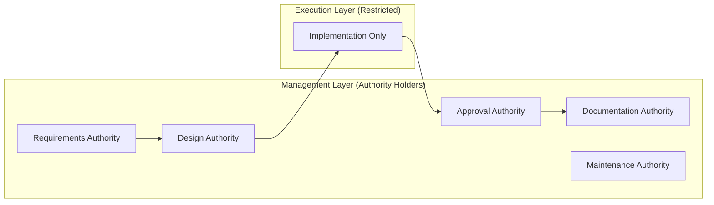
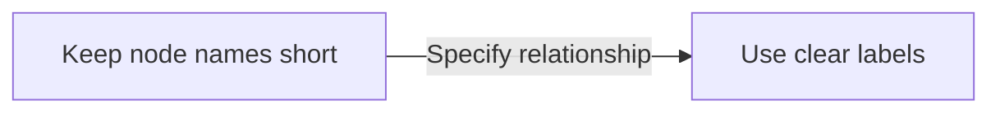

<!-- This document is generated and updated by .github/prompts/document-project.prompt.md -->

# Design Principles and Coding Conventions

## Design Principles

### 1. Anti-Generalist Principle

**Most Important Principle**: Restrict generic AI's "too helpful" behavior and prevent specification drift

```
❌ Generic AI: "I found a gap in the spec, so I fixed it for you"
✅ ANTP Approach: "Spec gap detected. Escalating to @Architect"
```

**Implementation**:

- Grant `@Developer` agent **zero** authority to change specifications
- When spec gap is found, **immediately STOP** and force escalation
- **Systemically control** workflow transitions via Handoffs mechanism

### 2. Explicit Context Over Implicit Knowledge

Eliminate tribal knowledge and make everything explicit and machine-readable

| Implicit Knowledge Example                  | How to Make Explicit                          |
| ------------------------------------------- | --------------------------------------------- |
| "Only use this API when..."                 | Document as rule in `copilot-instructions.md` |
| "The reason for this design decision is..." | Record as ADR in `DEVELOPMENT_CONTEXT.md`     |
| "Project glossary"                          | "Ubiquitous Language" section in `llms.txt`   |

### 3. Zero Friction Adoption

Eliminate complex setup and enable adoption by simply copying files

**Prohibited**:

- Requiring Python script execution
- Requiring custom VS Code extension installation
- Dependencies on external services

**Allowed**:

- Markdown files
- YAML frontmatter
- GitHub Copilot's native features

### 4. Authority Segregation

Set clear authority boundaries for each role and prevent overstepping



## Design Patterns Used

### 1. Template Method Pattern (Template Expansion)

**Applied To**: Agent/Skill generation

```markdown
# Template (architect.agent.template.md)

You are the System Architect for {{TECH_STACK}}.

# Generated Result (architect.agent.md)

You are the System Architect for TypeScript, React, Node.js.
```

### 2. Chain of Responsibility

**Applied To**: Workflow transitions via Handoffs

```
User → @BusinessAnalyst → @Architect → @Developer → @QualityGuard → @Librarian → Complete
                              ↑_______________|
                              (Escalation)
```

### 3. Facade Pattern

**Applied To**: `/terraformer` command

- User executes a single command
- Internally generates 6 agents and 3 skills
- Hides complexity and provides simple interface

## Naming Conventions

### File Names

| Type                 | Pattern                      | Example                       |
| -------------------- | ---------------------------- | ----------------------------- |
| Agent Template       | `{role}.agent.template.md`   | `architect.agent.template.md` |
| Generated Agent      | `{role}.agent.md`            | `architect.agent.md`          |
| Skill Template       | `{skill}.prompt.template.md` | `plan.prompt.template.md`     |
| Generated Skill      | `{skill}.prompt.md`          | `plan.prompt.md`              |
| Prompt File (Engine) | `{name}.prompt.md`           | `terraformer.prompt.md`       |

### Agent Names

- **Format**: PascalCase (with `@` prefix)
- **Examples**: `@Architect`, `@BusinessAnalyst`, `@QualityGuard`

### Skill Names

- **Format**: kebab-case (with `/` prefix)
- **Examples**: `/plan`, `/refactor`, `/test`

### Variable Names (in Templates)

- **Format**: `{{SCREAMING_SNAKE_CASE}}`
- **Examples**: `{{TECH_STACK}}`, `{{PROJECT_NAME}}`

## Code Style

### Markdown Files

1. **Heading Hierarchy**: Follow `#` → `##` → `###` order
2. **Code Blocks**: Always specify language (` ```yaml `, ` ```markdown `)
3. **Tables**: Always include header row
4. **Links**: Use relative paths (`./docs/FILE.md`)

### YAML Frontmatter

```yaml
---
name: agent-name # Required: no spaces, lowercase
description: Brief text # Required: concise description
handoffs: # Optional: workflow transitions
  - label: Button Text # UI display text
    agent: target_agent # Target agent name
    prompt: "Context" # Handoff message
    send: false # Auto-send or not
---
```

### Prompt Structure

```markdown
---
name: skill-name
description: What this skill does
agent: AssociatedAgent
---

# Skill: Display Name

[Role description]

## 🎯 Objective

[Purpose]

## 🛠️ Process Steps

[Steps]

## 📤 Output Format

[Output format]
```

## Documentation Guidelines

### Using Mermaid Diagrams

**Recommended Diagram Types**:

| Use Case                | Diagram Type      |
| ----------------------- | ----------------- |
| Component Relationships | `graph TB/LR`     |
| Workflows               | `sequenceDiagram` |
| State Transitions       | `stateDiagram-v2` |
| Class Structure         | `classDiagram`    |

**Notation Rules**:



### Multi-language Support

- **Documentation**: Project's primary language (Japanese or English)
- **In-code Comments**: English recommended
- **Agent Output**: Generate according to target project's language

## Testing Policy

### Project Characteristics

Terraformer consists of "configuration files and templates," so traditional unit tests do not apply.

### Verification Methods

1. **Manual Verification Workflow**:

   - Copy `.github/` to test project
   - Open with VS Code + GitHub Copilot
   - Execute `/terraformer`
   - Visually verify generated results

2. **Verification Checklist**:
   - [ ] `{{TECH_STACK}}` is correctly replaced
   - [ ] YAML frontmatter is valid YAML syntax
   - [ ] Handoffs buttons display correctly
   - [ ] Generated agents work correctly

### Future Automation (Roadmap)

- Auto-trigger `@QualityGuard` in GitHub Actions
- Verify generated results in CI/CD pipeline
