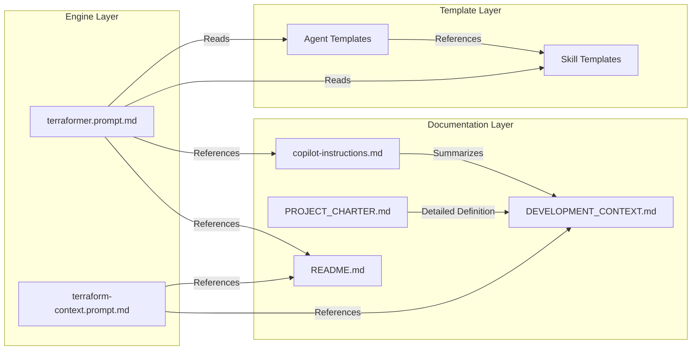
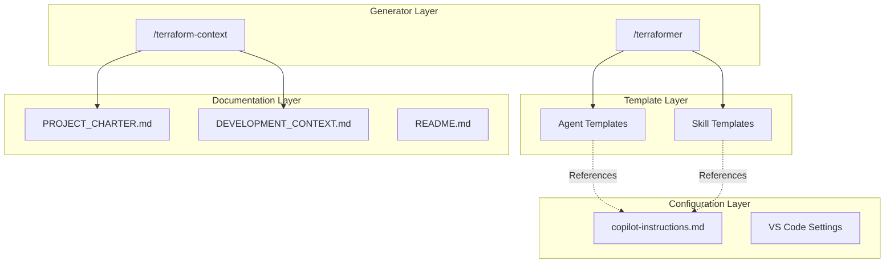

<!-- This document is generated/updated by the sync-doc workflow -->

# Directory Structure Guide

## Overall Structure

```
terraformer/
├── .github/
│   ├── copilot-instructions.md    # L1: Constitution (Project Rules)
│   ├── prompts/                    # Engine (Prompt Files)
│   │   ├── terraformer.prompt.md
│   │   └── terraform-context.prompt.md
│   └── templates/                  # Generation Templates
│       ├── *.agent.template.md     # L4: Agent Templates (7 types)
│       └── skills/                 # L2: Skill Templates
│           ├── audit.prompt.template.md
│           ├── debug.prompt.template.md
│           ├── doc-sync.prompt.template.md
│           ├── plan.prompt.template.md
│           ├── refactor.prompt.template.md
│           ├── requirements.prompt.template.md
│           └── test.prompt.template.md
│       └── docs/                   # Documentation Templates
│           ├── requirements.template.md
│           ├── review_report.template.md
│           ├── specification.template.md
│           └── bug_fix_plan.md
├── .vscode/
│   ├── extensions.json            # Recommended Extensions
│   └── settings.json              # VS Code Settings
├── docs/
│   ├── PROJECT_CHARTER.md         # ANTP v1.4 Protocol Definition
│   └── DEVELOPMENT_CONTEXT.md     # ADR (Architecture Decision Records)
├── agents-docs/                   # This documentation set
├── LICENSE                        # MIT License
├── mascot.png                     # ANTP-Bot Mascot Image
└── README.md                      # Entry Point (User-facing)
```

## Directory Responsibilities

### `/.github/`

**Role**: Storage for GitHub Copilot configuration files and Terraformer engine

#### `/.github/copilot-instructions.md`

- **Responsibility**: L1 Constitution Layer
- **Content**: Immutable rules applied to the entire project
- **Usage**: Automatically loaded when GitHub Copilot operates on this project
- **Update Frequency**: Rare (only when fundamental project policies change)

#### `/.github/prompts/`

**Role**: Terraformer engine executable files (Prompt Files)

| File                          | Responsibility                             | Trigger              |
| ----------------------------- | ------------------------------------------ | -------------------- |
| `terraformer.prompt.md`       | Main engine. Generates 7 agents + 7 skills | `/terraformer`       |
| `terraform-context.prompt.md` | Generates `AGENTS.md` context map          | `/terraform-context` |

- **Dependencies**: References template files in `templates/` directory
- **Update Frequency**: When improving engine logic

#### `/.github/templates/`

**Role**: Templates for generated agents and skills

##### Agent Templates (`*.agent.template.md`)

| Template                             | Generated Agent    | Authority Level                                |
| ------------------------------------ | ------------------ | ---------------------------------------------- |
| `architect.agent.template.md`        | `@Architect`       | Management Layer (Design & Spec Authority)     |
| `business_analyst.agent.template.md` | `@BusinessAnalyst` | Management Layer (Requirements Authority)      |
| `quality_guard.agent.template.md`    | `@QualityGuard`    | Management Layer (Merge Approval Authority)    |
| `librarian.agent.template.md`        | `@Librarian`       | Management Layer (Documentation Authority)     |
| `gardener.agent.template.md`         | `@Gardener`        | Management Layer (Refactoring Authority)       |
| `debugger.agent.template.md`         | `@Debugger`        | Management Layer (Bug Analysis Authority)      |
| `developer.agent.template.md`        | `@Developer`       | Execution Layer (**NO Spec Change Authority**) |

##### Skill Templates (`skills/*.prompt.template.md`)

| Template                          | Generated Skill | Used By                       |
| --------------------------------- | --------------- | ----------------------------- |
| `plan.prompt.template.md`         | `/plan`         | `@Architect`                  |
| `requirements.prompt.template.md` | `/requirements` | `@BusinessAnalyst`            |
| `audit.prompt.template.md`        | `/audit`        | `@QualityGuard`               |
| `doc-sync.prompt.template.md`     | `/doc-sync`     | `@Librarian`                  |
| `refactor.prompt.template.md`     | `/refactor`     | `@Gardener`                   |
| `debug.prompt.template.md`        | `/debug`        | `@Debugger`                   |
| `test.prompt.template.md`         | `/test`         | `@Developer`, `@QualityGuard` |

- **Feature**: Contains `{{TECH_STACK}}` placeholder
- **Update Frequency**: When adding new framework support or updating best practices

### `/.vscode/`

**Role**: VS Code development environment settings

| File              | Responsibility                                                          |
| ----------------- | ----------------------------------------------------------------------- |
| `extensions.json` | Recommended extensions definition (Copilot Chat, Mermaid Preview, etc.) |
| `settings.json`   | Project-specific VS Code settings                                       |

### `/docs/`

**Role**: Official project documentation (Shared context with AI)

| File                     | Responsibility                                                    | Target Audience         |
| ------------------------ | ----------------------------------------------------------------- | ----------------------- |
| `PROJECT_CHARTER.md`     | Official ANTP v1.4 protocol definition, vision, roadmap           | Designers, Contributors |
| `DEVELOPMENT_CONTEXT.md` | ADR (Architecture Decision Records), technical "why" explanations | AI, Developers          |

- **Important**: `DEVELOPMENT_CONTEXT.md` serves as the **primary context source for AI**
- **Update Frequency**: When adding or changing design decisions

### `/agents-docs/`

**Role**: Documentation set for LLMs to efficiently understand the project

- **Generated By**: `.github/prompts/document-project.prompt.md`
- **Update Frequency**: When project structure changes

## Module Dependency Diagram



## Layer Structure

Since this project consists of "configuration and templates" rather than "code," it has a different layer structure from traditional MVC or Clean Architecture.



### Layer Responsibilities

| Layer                   | Responsibility                                    | Change Frequency                          |
| ----------------------- | ------------------------------------------------- | ----------------------------------------- |
| **Generator Layer**     | Analyzes target project and generates artifacts   | Medium (when adding features)             |
| **Template Layer**      | Defines templates for generated files             | Medium (when supporting new technologies) |
| **Configuration Layer** | Defines project rules and development environment | Low (only when policies change)           |
| **Documentation Layer** | Provides context for humans and AI                | Medium (when design changes)              |

## Generated Output Location (Target Project)

Files generated by Terraformer are placed in the following locations in the target project:

```
target-project/
├── .github/
│   ├── agents/                    # L4: Generated Agents
│   │   ├── architect.agent.md
│   │   ├── business_analyst.agent.md
│   │   ├── quality_guard.agent.md
│   │   ├── librarian.agent.md
│   │   ├── gardener.agent.md
│   │   └── developer.agent.md
│   └── prompts/                   # L2: Generated Skills
│       ├── plan.prompt.md
│       ├── refactor.prompt.md
│       └── test.prompt.md
└── AGENTS.md                      # L3: Generated Context Map
```
