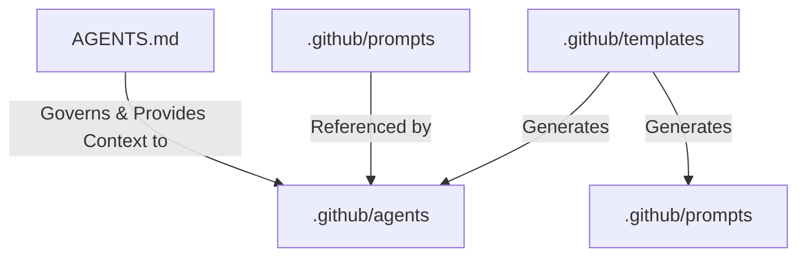

<!-- This document is generated/updated by the sync-doc workflow -->

# Directory Structure Guide

## Overall Configuration

The Terraformer project is structured as a configuration repository that is meant to be copied into a target project.

```
terraformer/
├── .agent/                 # Agent workflows and internal configurations
├── .github/                # The core engine (to be copied to target)
│   ├── agents/             # Generated Agent definitions (L4) [Generated in Target]
│   ├── prompts/            # Skill definitions (L2)
│   ├── templates/          # Source templates for Agents and Skills

├── agents-docs/            # Documentation for the Terraformer system itself
├── docs/                   # High-level documentation (Charter, Context)
├── AGENTS.md               # Constitution (L1) & Knowledge Map (L3)
└── README.md               # User Guide
```

## Responsibilities of Each Directory

### `/.github/`

- **Role**: Contains the core configuration for GitHub Copilot. This is the "deployable" part of Terraformer.
- **Key Files**: (None)
- **Subdirectories**: `prompts/`, `templates/`

### `/.github/templates/`

- **Role**: Stores the Jinja2/Liquid-style templates used to generate the actual Agent and Skill files for a specific project.
- **Key Files**: `architect.agent.template.md`, `developer.agent.template.md`

### `/.github/prompts/`

- **Role**: Contains the "Skills" (SOPs) that agents can execute.
- **Key Files**: `terraformer.prompt.md` (The meta-skill to generate others), `plan.prompt.md`

### `/agents-docs/`

- **Role**: Documentation specifically designed to be consumed by AI agents (and humans) to understand the Terraformer system.
- **Key Files**: `architecture.md`, `key-flows.md`

## Module Dependency Diagram



## Layer Structure

- **Meta-Layer**: `.github/templates/` (The "Source Code" of Terraformer)
- **Runtime Layer**: `.github/agents/`, `.github/prompts/` (The "Compiled" configuration used by Copilot)
- **Context Layer**: `AGENTS.md`
