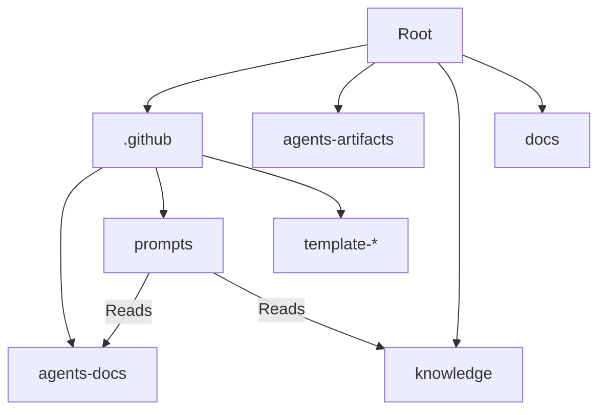

<!-- This document is generated/updated by the sync-doc workflow -->

# Directory Structure Guide

## Overall Configuration

Terraformer uses a specific directory structure to organize its components. Since it is a "Meta-Engine" installed into other projects, its structure is designed to be overlay-friendly.

```
terraformer/
├── .agent/                 # Antigravity specific definitions (Workflows, etc.)
├── .github/                # The Core Engine (Prompts, Templates)
│   ├── agents/             # Generated Agent Definitions (L4)
│   ├── prompts/            # Skill Definitions (L2)
│   └── template-*/         # Source templates for generating agents/skills
├── agents-docs/            # Documentation written FOR Agents (L3)
├── docs/                   # Human-oriented documentation (Project Charter, ADRs)
├── knowledge/              # Universal/Reusable Knowledge (Not project-specific)
├── AGENTS.md               # The Constitution & Context Map Entry Point (L1)
└── README.md               # Project Introduction
```

## Responsibilities of Each Directory

### `/.github/prompts/`

- **Role**: Contains the "Skills" (SOPs) available to agents.
- **Key Files**: `terraformer.prompt.md`, `terraform-context.prompt.md`
- **Dependencies**: These files are referenced by Copilot Custom Prompts (commands).

### `/.github/template-*/`

- **Role**: Stores the blueprints used by the `/terraformer` command to generate project-specific assets.
- **Key Files**: Agent definitions, skill templates.
- **Dependencies**: Used by the Terraformer meta-prompt.

### `/agents-docs/`

- **Role**: Stores documentation specifically designed to be read by AI agents to understand the specific project's context.
- **Key Files**: `architecture.md`, `tech-stack.md`, etc.
- **Dependencies**: Referenced by `AGENTS.md` and various Skills.

### `/knowledge/`

- **Role**: A library of "Universal Knowledge" that applies across multiple projects. Contains best practices, prompting guides, and review checklists.
- **Key Files**: `prompting-techniques.md`, `xml-structured-prompting.md`, `specification-guidelines.md`.
- **Dependencies**: Can be symlinked or copied to other projects.

### `/docs/`

- **Role**: Contains high-level documentation primarily for human readers, though agents can also read them.
- **Key Files**: `PROJECT_CHARTER.md` (Mission), `DEVELOPMENT_CONTEXT.md` (ADRs).

### `/agents-artifacts/`

- **Role**: Stores artifacts generated by agents (e.g., diagrams, reports).

## Module Dependency Diagram



## Layer Structure

1.  **Configuration Layer**: `.github/` - Defines HOW the system works.
2.  **Context Layer**: `agents-docs/`, `AGENTS.md` - Defines WHAT the system works on.
3.  **Reference Layer**: `knowledge/`, `docs/` - Defines WHY and HOW-TO mechanisms.
