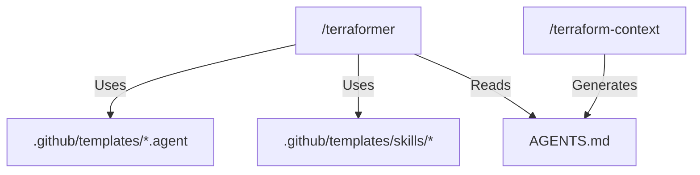

<!-- This document is generated/updated by the sync-doc workflow -->

# Directory Structure Guide

## Overall Configuration

The Terraformer repository is structured to host the "Source Code" (Templates and Meta-Prompts) of the engine.

```
terraformer/
├── .github/                # The Core Engine
│   ├── prompts/            # Meta-Skills (Entry Points)
│   └── templates/          # Source Templates for Agents and Skills
├── agents-docs/            # L3: Knowledge (Documentation for AI)
├── docs/                   # Human-oriented Documentation
├── AGENTS.md               # L1: Constitution & Context Map
├── README.md               # Project Entry Point
└── LICENSE                 # License File
```

## Responsibilities of Each Directory

### `/.github/prompts/`

- **Role**: Contains the "Executable" meta-prompts that drive the Terraformer engine.
- **Key Files**:
  - `terraformer.prompt.md`: The main generator script. Invoked via `/terraformer`.
  - `terraform-context.prompt.md`: The context analyzer. Invoked via `/terraform-context`.

### `/.github/templates/`

- **Role**: Contains the "Blueprints" used to generate the AI environment in the user's project.
- **Subdirectories**:
  - `skills/`: Templates for skill prompts (e.g., `plan.prompt.template.md`).
  - `docs/`: Templates for documentation generation.
- **Key Files**:
  - `*.agent.template.md`: Templates for agent definitions (e.g., `architect.agent.template.md`).

### `/agents-docs/`

- **Role**: Stores high-density, structured documentation specifically designed for AI Agents to "learn" about the project.
- **Key Files**:
  - `architecture.md`: System design.
  - `key-flows.md`: How the system works.
  - `glossary.md`: Ubiquitous language.

### `/docs/`

- **Role**: Stores broad, human-centric documentation and historical context.
- **Key Files**:
  - `PROJECT_CHARTER.md`: The "Why" and "What" of the project.
  - `DEVELOPMENT_CONTEXT.md`: Architectural Decision Records (ADR) and background.

### Root Files

- **`AGENTS.md`**: The Constitution. Defines the project's high-level context, rules, and the "Mental Model" for all agents.
- **`README.md`**: Installation and usage instructions for humans.

## Module Dependency Diagram


