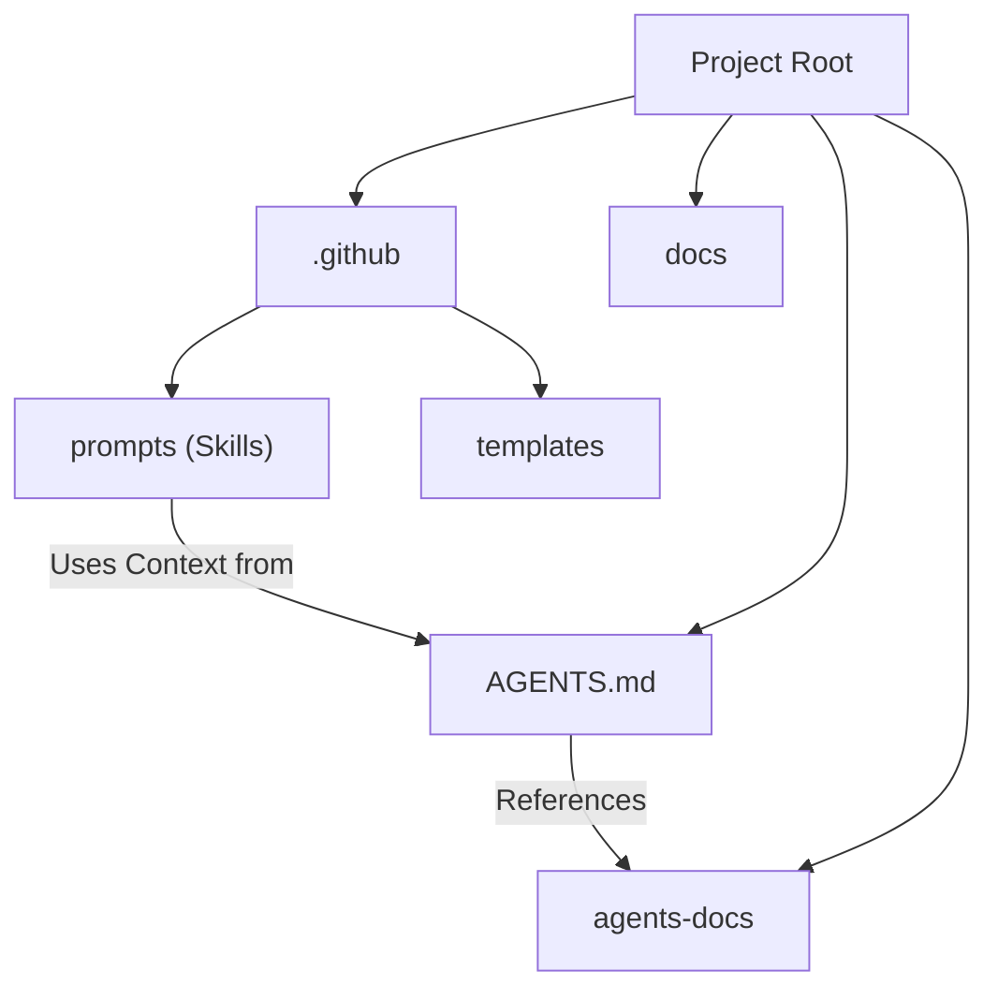

<!-- This document is generated/updated by the sync-doc workflow -->

# Directory Structure Guide

## Overall Configuration

Terraformer follows a specific directory structure designed to be overlayed onto existing projects. It separates configuration (prompts, agents) from documentation and the actual project code.

## Responsibilities of Each Directory

### `.github/`

- **Role**: The core engine of Terraformer. Contains all the configuration files that drive GitHub Copilot's behavior.
- **Key Subdirectories**:
  - `prompts/`: Contains Skill definitions (`*.prompt.md`). These are the executable instructions for agents.
  - `templates/`: Contains templates for creating new agents and skills.
  - `agents/`: (In target projects) Contains the specific Agent definitions (`*.agent.md`).

### `agents-docs/`

- **Role**: The Knowledge Layer (L3). Contains detailed documentation specifically formatted for AI consumption.
- **Key Files**:
  - `architecture.md`: System overview.
  - `key-flows.md`: Important workflows.
  - `coding-conventions.md`: Rules and patterns.
- **Dependencies**: Referenced by `AGENTS.md` and various Skills.

### `docs/`

- **Role**: Human-oriented documentation and high-level project context.
- **Key Files**:
  - `PROJECT_CHARTER.md`: The mission and core philosophy.
  - `DEVELOPMENT_CONTEXT.md`: Architectural Decision Records (ADR) and background.

### Root Files

- `AGENTS.md`: The Constitution (L1). Serves as the entry point and context map for AI agents.
- `README.md`: General project introduction and installation guide.

## Module Dependency Diagram

## Layer Structure

The directory structure directly maps to the ANTP layers:

- **L1 (Constitution)**: `AGENTS.md` (Root)
- **L2 (Skills)**: `.github/prompts/`
- **L3 (Knowledge)**: `agents-docs/`
- **L4 (Agents)**: `.github/agents/` (and `AGENTS.md` definitions)
