<!-- This document is generated/updated by the sync-doc workflow -->

# Key Functional Flows

## Entry Points

Terraformer has two main entry points:

| Command              | Purpose                       | Output              |
| -------------------- | ----------------------------- | ------------------- |
| `/terraformer`       | Generate or Update AI agents and skills | 6 agents + 3 skills |
| `/terraform-context` | Generate context map          | `AGENTS.md`         |

### Startup Flow

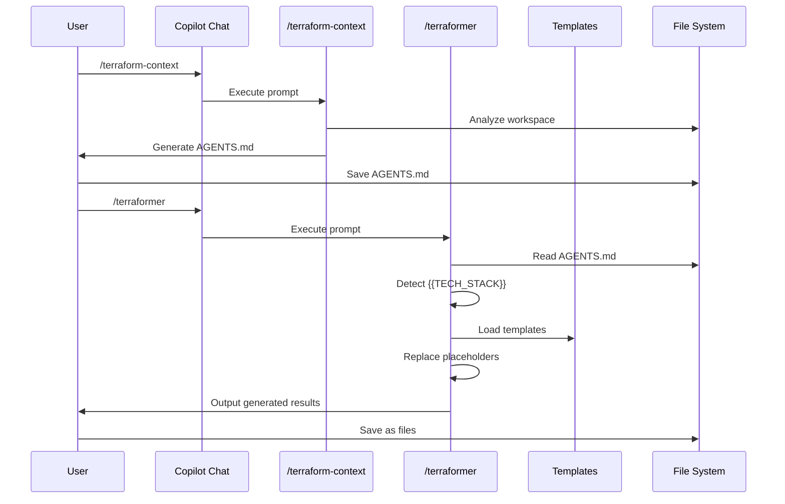

## Use Case 1: AI-Native Transformation of a Project

### Overview

Apply Terraformer to a legacy project to build an AI-Native environment

### Sequence Diagram

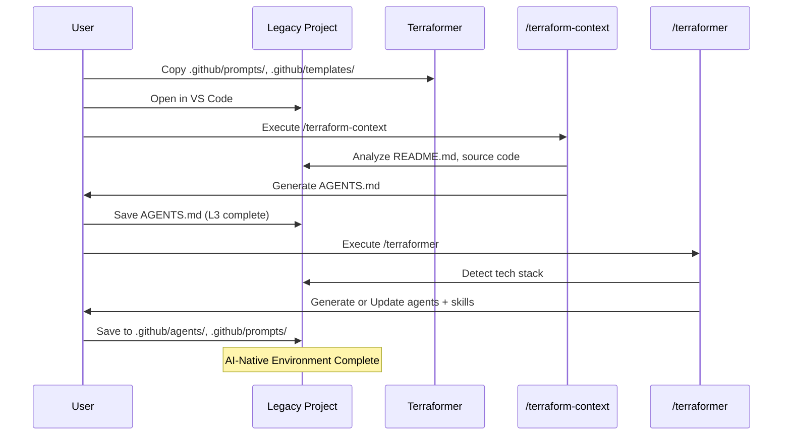

### Related Files

- `.github/prompts/terraformer.prompt.md` - Main engine
- `.github/prompts/terraform-context.prompt.md` - Context generation
- `.github/templates/*.agent.template.md` - Agent templates
- `.github/templates/skills/*.prompt.template.md` - Skill templates

### Process Flow

1. **Preparation**: Copy Terraformer's `.github/` to target project
2. **L3 Generation**: Generate and save `AGENTS.md` with `/terraform-context`
3. **L4+L2 Generation**: Generate or Update agents and skills with `/terraformer`
4. **Verification**: Invoke generated agents with `@Agent` to verify operation

---

## Use Case 2: Feature Development Workflow (Post-Generation)

### Overview

Standard flow for developing features using Terraformer-generated agents

### Sequence Diagram

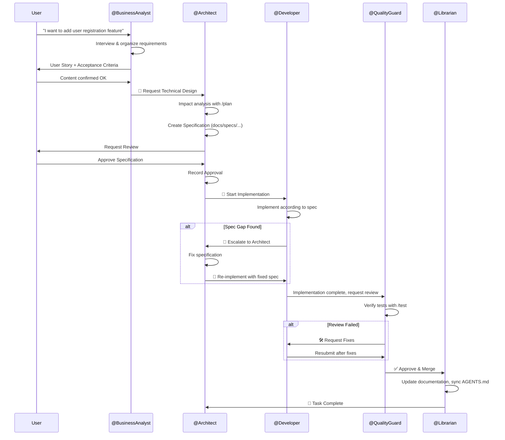

### Related Files (Post-Generation)

- `.github/agents/architect.agent.md` - Designer agent
- `.github/agents/business_analyst.agent.md` - Requirements agent
- `.github/agents/developer.agent.md` - Implementer agent
- `.github/agents/quality_guard.agent.md` - Quality management agent
- `.github/agents/librarian.agent.md` - Documentation agent
- `.github/prompts/plan.prompt.md` - Planning skill
- `.github/prompts/test.prompt.md` - Testing skill

### Process Flow

1. **Requirements Definition**: `@BusinessAnalyst` creates User Story
2. **Design**: `@Architect` creates a specification file (`docs/specs/...`)
3. **Review**: User reviews and approves the specification
4. **Implementation**: `@Developer` implements code according to the approved spec
4. **Escalation**: Return to `@Architect` when spec gap is found
5. **Review**: `@QualityGuard` verifies code quality and tests
6. **Documentation**: `@Librarian` updates documentation
7. **Complete**: Cycle ends

---

## Use Case 3: Refactoring Workflow

### Overview

Safely resolve technical debt and improve code

### Sequence Diagram

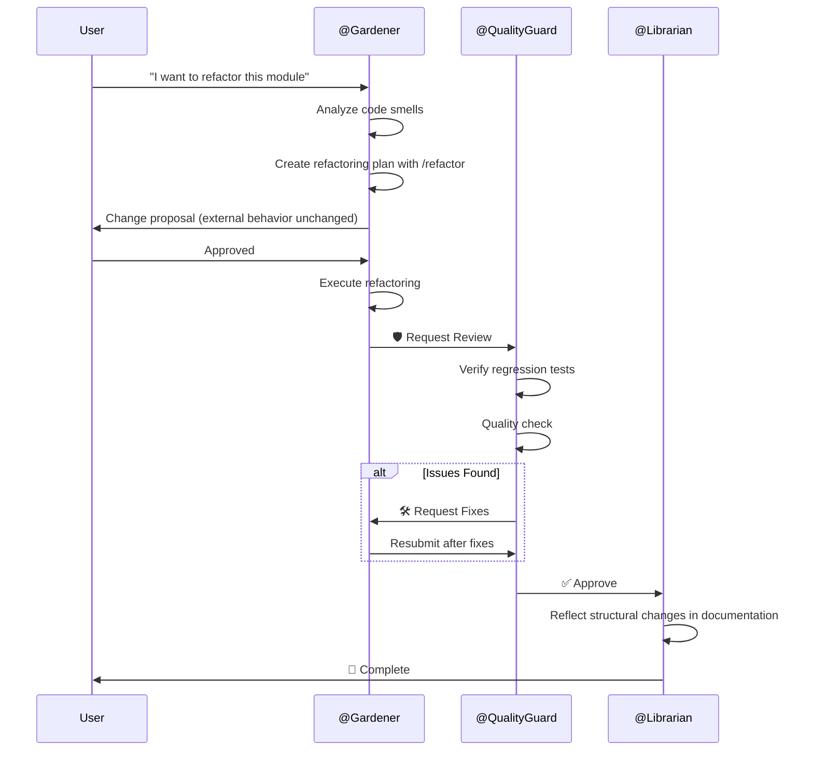

### Related Files

- `.github/agents/gardener.agent.md` - Maintenance agent
- `.github/prompts/refactor.prompt.md` - Refactoring skill

### Process Flow

1. **Analysis**: `@Gardener` identifies code smells in target code
2. **Planning**: Create safe refactoring plan with `/refactor` skill
3. **Execution**: Improve structure without changing external behavior
4. **Verification**: `@QualityGuard` confirms no regressions
5. **Documentation**: `@Librarian` records changes

---

## Use Case 4: Escalation Flow

### Overview

Response flow when `@Developer` discovers spec gaps or contradictions

### Sequence Diagram

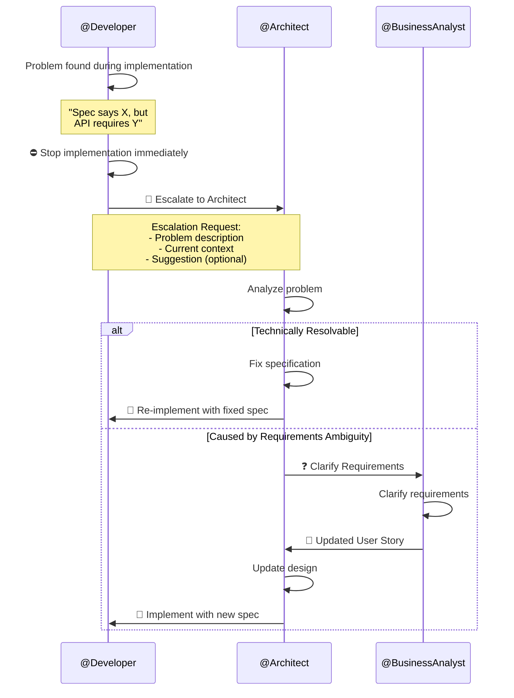

### Process Flow

1. **Detection**: `@Developer` discovers contradiction between spec and implementation
2. **Stop**: **Immediately** stop implementation (don't proceed with guesses)
3. **Report**: Output structured escalation request
4. **Resolution**: `@Architect` fixes spec or confirms with `@BusinessAnalyst`
5. **Resume**: Resume implementation with fixed specification

### Escalation Request Format

```markdown
> **🛑 ESCALATION REQUIRED**
>
> **Problem**: [Description of spec vs API contradiction]
>
> **Context**:
>
> - Specification: [Relevant section]
> - Actual API: [Actual behavior]
>
> **Impact**: [Risk if proceeding as-is]
>
> _Please use the 'Escalate to Architect' button above._
```

---

---

## Use Case 5: Bug Fix Flow

### Overview

Structured workflow for identifying, analyzing, and fixing bugs, including escalation for specification flaws.

### Sequence Diagram

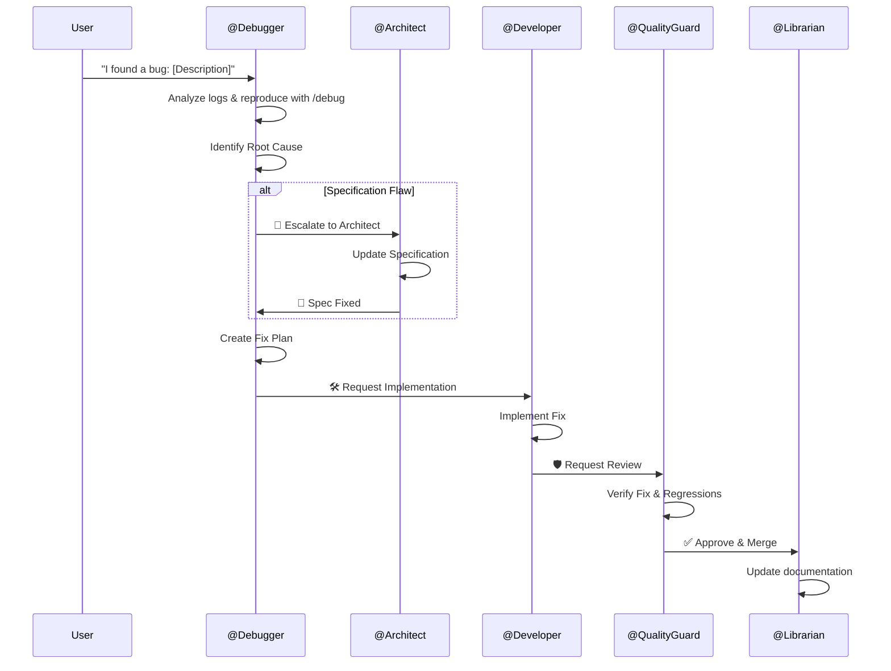

### Related Files

- `.github/agents/debugger.agent.md` - Bug analysis agent
- `.github/prompts/debug.prompt.md` - Debugging skill

### Process Flow

1. **Discovery**: User reports a bug or logs indicate failure.
2. **Analysis**: `@Debugger` uses `/debug` to analyze and reproduce the issue.
3. **Decision**:
    - If code error: Proceed to Fix Plan.
    - If spec flaw: Escalate to `@Architect` for spec update.
4. **Implementation**: `@Developer` implements the fix based on the plan.
5. **Verification**: `@QualityGuard` verifies the fix.

---

## Use Case 6: Prototype Development

### Overview

Rapidly build a working prototype to validate ideas or demonstrate functionality. Speed is prioritized over strict process adherence.

### Sequence Diagram

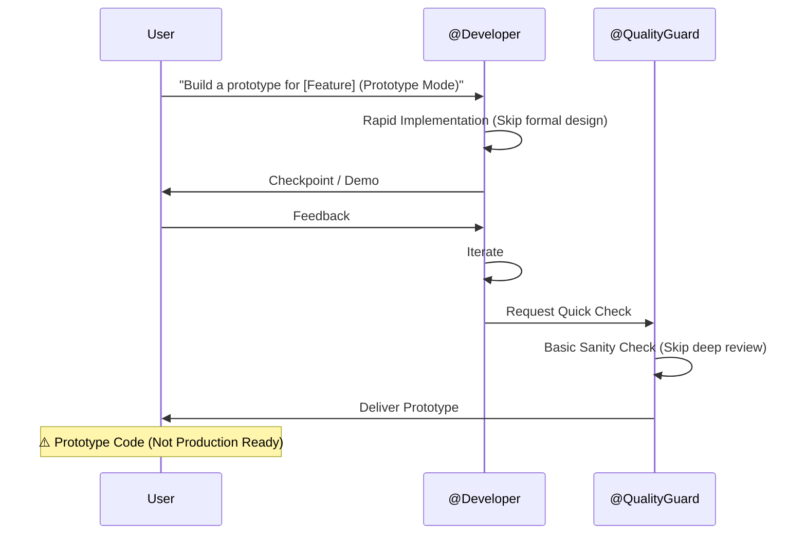

### Process Flow

1.  **Request**: User explicitly requests "Prototype Mode".
2.  **Implementation**: `@Developer` implements directly, skipping formal `@Architect` design phase if appropriate.
3.  **Iteration**: Fast feedback loops with the user.
4.  **Delivery**: Code is delivered as a **Prototype**.
5.  **Cleanup**: Prototype code must be revisited for productionization (Refactor/Rewrite) later.

---

## Skill Execution Flows

### `/plan` Skill

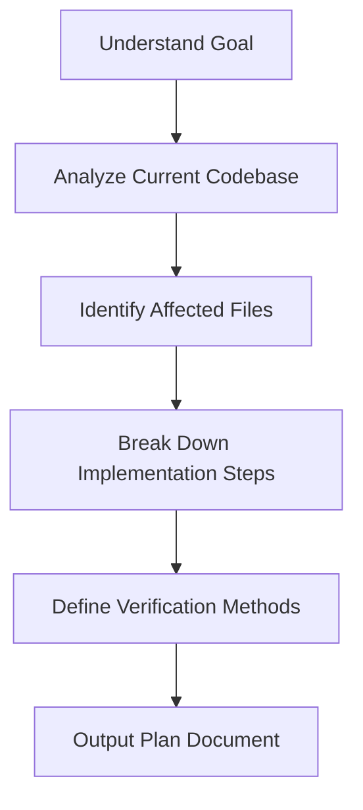

### `/refactor` Skill

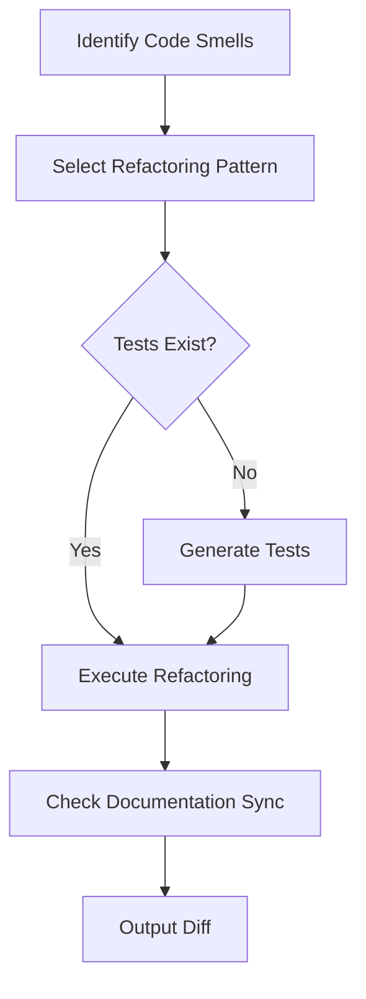

### `/test` Skill

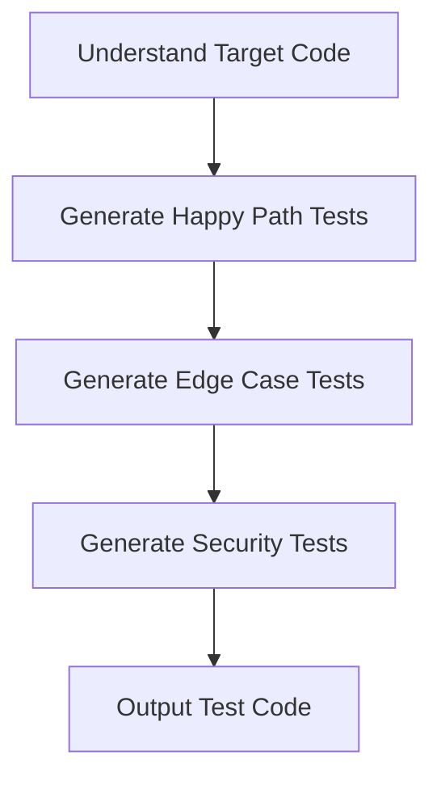

### `/doc-sync` Skill

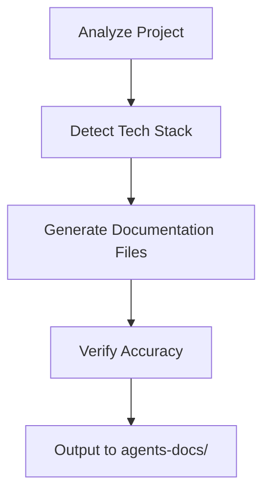

### `/requirements` Skill

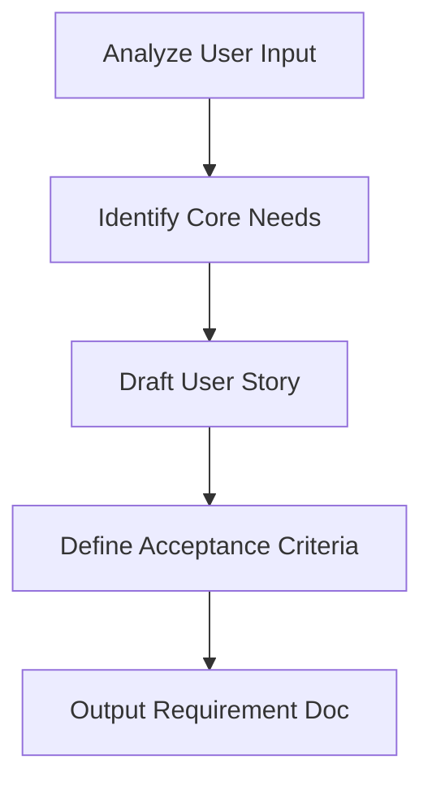

### `/audit` Skill

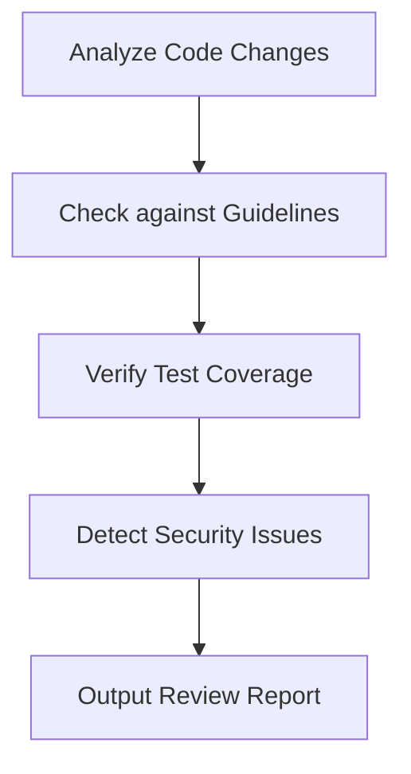

### `/debug` Skill

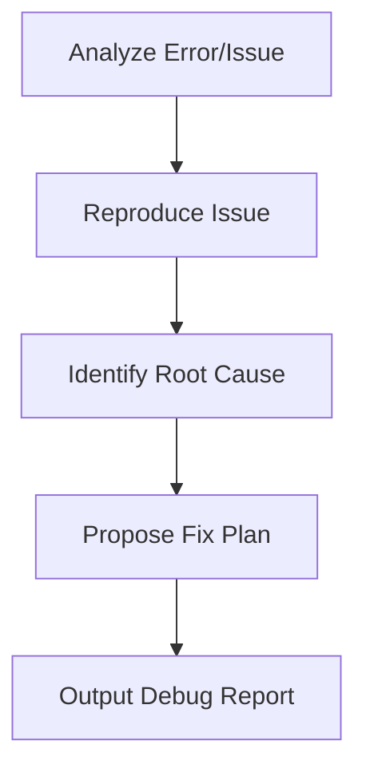
