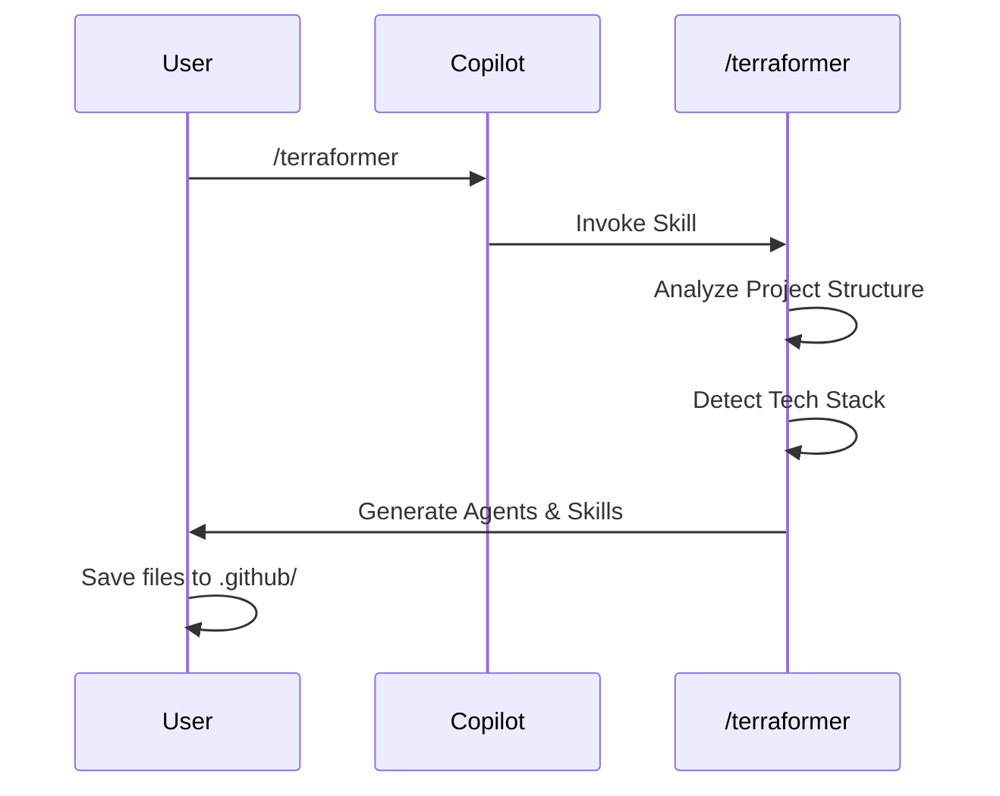
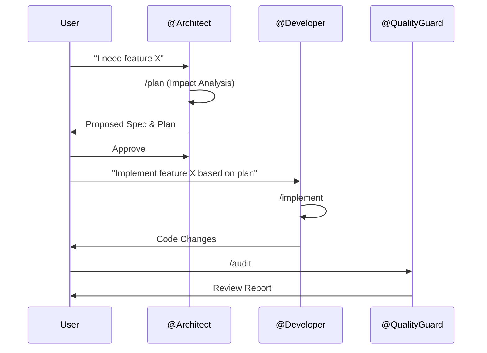
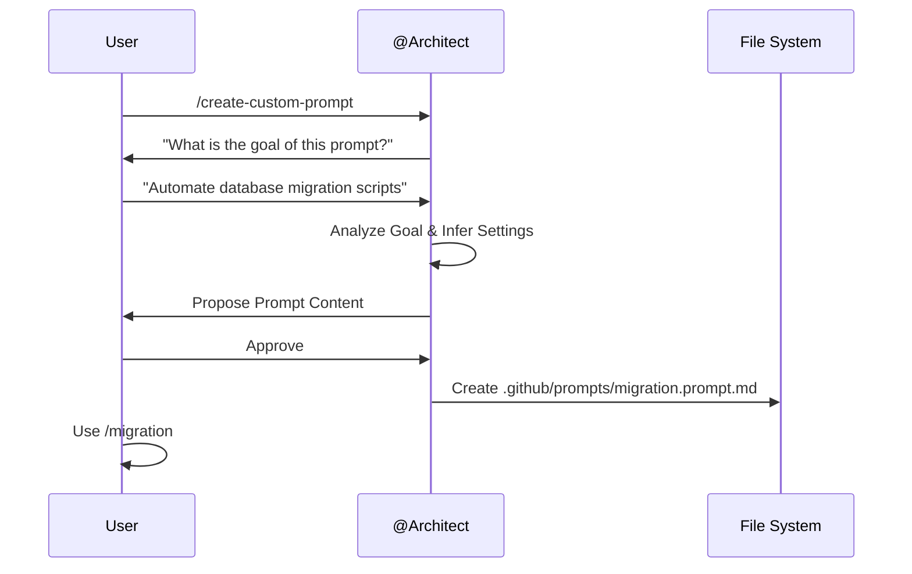

<!-- This document is generated/updated by the sync-doc workflow -->

# Key Feature Flows

## Entry Point

The primary entry point for using Terraformer is the **GitHub Copilot Chat** interface in VS Code.

## Use Case 1: Initial Setup (Terraforming)

### Overview

Transforming a legacy project into an AI-Ready environment by generating the initial configuration.

### Sequence Diagram

### Related Files

- `.github/prompts/terraformer.prompt.md` - The meta-skill logic.
- `.github/templates/*.template.md` - The blueprints used for generation.

### Processing Flow

1.  User runs `/terraformer`.
2.  The skill analyzes the workspace to identify languages and frameworks.
3.  It reads the templates from `.github/templates/`.
4.  It populates the templates with project-specific context.
5.  It outputs the content for `AGENTS.md`, `.github/agents/*`, and `.github/prompts/*`.

## Use Case 2: Feature Implementation

### Overview

Implementing a new feature using the specialized agent team.

### Sequence Diagram

### Related Files

- `.github/prompts/plan.prompt.md`
- `.github/prompts/implement.prompt.md`
- `.github/prompts/audit.prompt.md`

### Processing Flow

1.  **Planning**: `@Architect` uses `/plan` to create a detailed implementation plan.
2.  **Implementation**: `@Developer` uses `/implement` to write code. **Constraint**: Cannot change specs.
3.  **Review**: `@QualityGuard` uses `/audit` to verify the implementation against the plan and coding standards.

## Use Case 3: Extending the Environment (Customization)

### Overview

Creating project-specific skills to handle unique workflows or requirements not covered by the standard ANTP set.

### Sequence Diagram

### Related Files

- `.github/templates/skills/create-custom-prompt.prompt.template.md`

### Processing Flow

1.  **Initiation**: User invokes `/create-custom-prompt`.
2.  **Interview**: `@Architect` interviews the user to understand the specific need.
3.  **Generation**: The agent generates a new `.prompt.md` file following best practices.
4.  **Usage**: The new skill becomes immediately available to the team (e.g., `/migration`).
