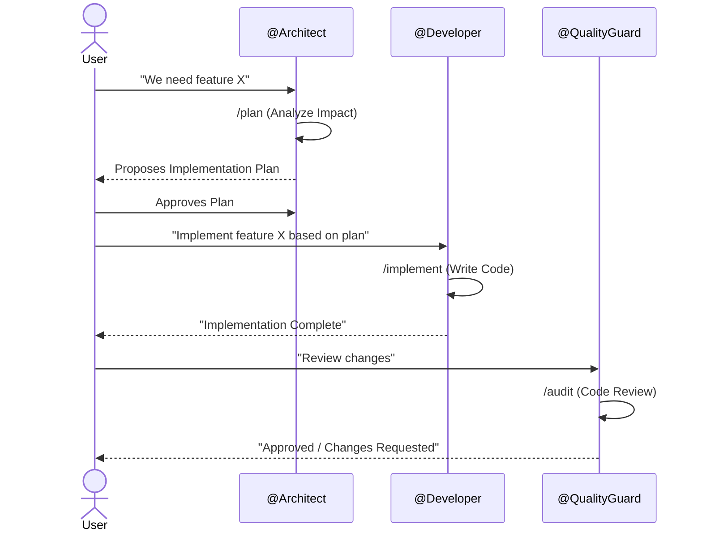

<!-- This document is generated/updated by the sync-doc workflow -->

# Key Feature Flows

## Entry Point

The primary entry point for the user is **GitHub Copilot Chat** in VS Code. The user interacts with the system by invoking Agents (`@Name`) or running Skills (`/command`).

## Use Case 1: Initializing a Project

### Overview

Transforming a legacy project into an AI-Ready environment.

### Processing Flow

1.  **Install**: User copies `.github` folder to the target project.
2.  **Context**: User runs `/terraform-context`.
    - Terraformer analyzes the project structure.
    - Generates `AGENTS.md` with a high-density summary.
3.  **Team Gen**: User runs `/terraformer`.
    - Terraformer reads `AGENTS.md`.
    - Generates customized `.github/agents/*.agent.md`.
    - Generates standard `.github/prompts/*.prompt.md`.

## Use Case 2: Implementing a Feature

### Overview

Standard flow for adding a new feature using the specialized agent team.

### Sequence Diagram

## Use Case 3: Prototype Mode

### Overview

Rapid development where strict checks are relaxed.

### Processing Flow

1.  User requests: "Build a prototype for [Feature] (Prototype Mode)".
2.  `@Developer` acknowledges "Prototype Mode".
3.  `@Developer` implements code without requiring a formal spec from `@Architect`.
4.  Generated code is marked with `/* PROTOTYPE */`.
5.  `@QualityGuard` performs a lightweight review.
