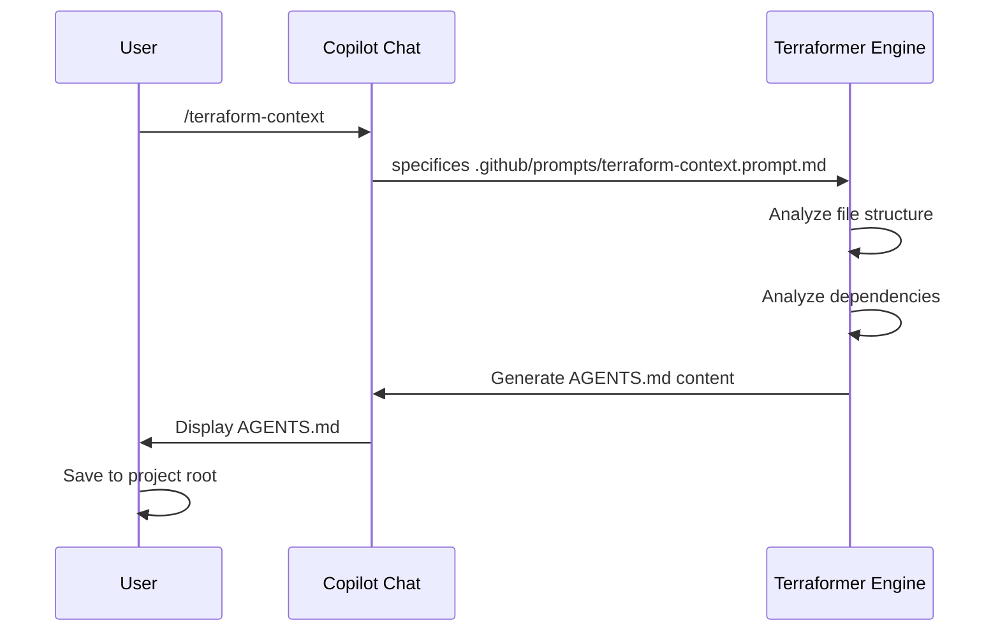

<!-- This document is generated/updated by the sync-doc workflow -->

# Key Feature Flows

## Entry Point

The entry point for any project using Terraformer is the generation of the Context Map.

## Flow 1: Context Map Generation (`/terraform-context`)

### Overview

Analyzes the existing project structure and generates `AGENTS.md` to serve as the "Constitution" and "Knowledge Hub" for the AI agents.

### Sequence Diagram

## Flow 2: AI Team Generation (`/terraformer`)

### Overview

Based on the `AGENTS.md` context, generates specialized AI agents (e.g., `@Architect`, `@Developer`) and their skills.

### Process Flow

1.  **User** ensures `AGENTS.md` is open or in context.
2.  **User** types `/terraformer` in Copilot Chat.
3.  **Engine** analyzes the tech stack defined in `AGENTS.md`.
4.  **Engine** selects appropriate templates from `.github/templates/`.
5.  **Engine** generates:
    - `.github/agents/*.agent.md` (Agent Definitions)
    - `.github/prompts/*.prompt.md` (Skill Definitions)
6.  **User** saves these files.

## Flow 3: Task Execution (The "Anti-Generalist" Flow)

### Overview

How a user interacts with the generated agents to build a feature.

### Related Files

- `.github/agents/Architect.agent.md`
- `.github/agents/Developer.agent.md`
- `.github/prompts/plan.prompt.md`

### Processing Flow

1.  **User** asks `@Architect` to "Plan feature X".
2.  **@Architect** uses `/plan` skill to generate `implementation_plan.md`.
3.  **User** reviews and approves the plan.
4.  **User** asks `@Developer` to "Implement feature X based on the plan".
5.  **@Developer** reads the plan and implements code. _Note: Developer cannot change the plan._
6.  **User** asks `@QualityGuard` to "Review the changes".
