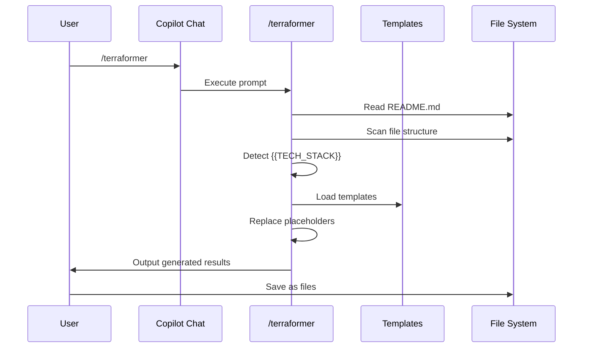
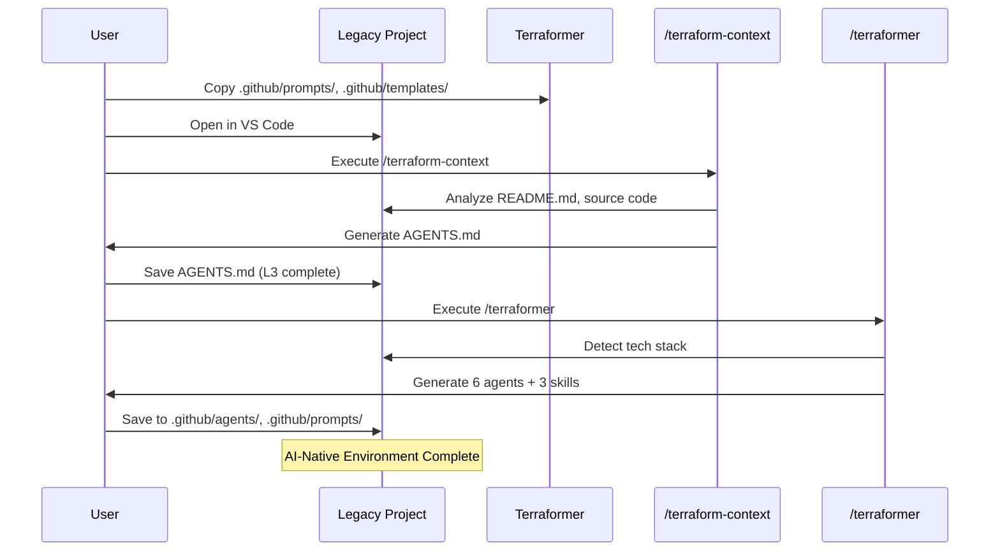

```mermaid
sequenceDiagram
    participant U as User
    participant GD as @Gardener
    participant QG as @QualityGuard
    participant LB as @Librarian

    U->>GD: "I want to refactor this module"
    GD->>GD: Analyze code smells
    GD->>GD: Create refactoring plan with /refactor
    GD->>U: Change proposal (external behavior unchanged)

    U->>GD: Approved
    GD->>GD: Execute refactoring
    GD->>QG: 🛡️ Request Review

    QG->>QG: Verify regression tests
    QG->>QG: Quality check

    alt Issues Found
        QG->>GD: 🛠️ Request Fixes
        GD->>QG: Resubmit after fixes
    end

    QG->>LB: ✅ Approve
    LB->>LB: Reflect structural changes in documentation
    LB->>U: 🏁 Complete
```

```mermaid
sequenceDiagram
    participant DV as @Developer
    participant AR as @Architect
    participant BA as @BusinessAnalyst

    DV->>DV: Problem found during implementation
    Note over DV: "Spec says X, but<br/>API requires Y"

    DV->>DV: ⛔ Stop implementation immediately
    DV->>AR: 🛑 Escalate to Architect
    Note over DV,AR: Escalation Request:<br/>- Problem description<br/>- Current context<br/>- Suggestion (optional)

    AR->>AR: Analyze problem

    alt Technically Resolvable
        AR->>AR: Fix specification
        AR->>DV: 🚀 Re-implement with fixed spec
    else Caused by Requirements Ambiguity
        AR->>BA: ❓ Clarify Requirements
        BA->>BA: Clarify requirements
        BA->>AR: 📐 Updated User Story
        AR->>AR: Update design
        AR->>DV: 🚀 Implement with new spec
    end
```

<!-- This document is generated and updated by .github/prompts/document-project.prompt.md -->

# Key Functional Flows

## Entry Points

Terraformer has two main entry points:

| Command              | Purpose                       | Output              |
| -------------------- | ----------------------------- | ------------------- |
| `/terraformer`       | Generate AI agents and skills | 6 agents + 3 skills |
| `/terraform-context` | Generate context map          | `AGENTS.md`         |

### Startup Flow



## Use Case 1: AI-Native Transformation of a Project

### Overview

Apply Terraformer to a legacy project to build an AI-Native environment

### Sequence Diagram



### Related Files

- `.github/prompts/terraformer.prompt.md` - Main engine
- `.github/prompts/terraform-context.prompt.md` - Context generation
- `.github/templates/*.agent.template.md` - Agent templates
- `.github/templates/skills/*.prompt.template.md` - Skill templates

### Process Flow

1. **Preparation**: Copy Terraformer's `.github/` to target project
2. **L3 Generation**: Generate and save `AGENTS.md` with `/terraform-context`
3. **L4+L2 Generation**: Generate and save agents and skills with `/terraformer`
4. **Verification**: Invoke generated agents with `@Agent` to verify operation

---

## Use Case 2: Feature Development Workflow (Post-Generation)

### Overview

Standard flow for developing features using Terraformer-generated agents

### Sequence Diagram



```mermaid
sequenceDiagram
    participant U as User
    participant BA as @BusinessAnalyst
    participant AR as @Architect
    participant DV as @Developer
    participant QG as @QualityGuard
    participant LB as @Librarian

    U->>BA: "I want to add user registration feature"
    BA->>BA: Interview & organize requirements
    BA->>U: User Story + Acceptance Criteria

    U->>BA: Content confirmed OK
    BA->>AR: 📐 Request Technical Design

    AR->>AR: Impact analysis with /plan
    AR->>U: Design proposal (Mermaid diagrams, API specs)
    U->>AR: Design approved

    AR->>DV: 🚀 Start Implementation
    DV->>DV: Implement according to spec

    alt Spec Gap Found
        DV->>AR: 🛑 Escalate to Architect
        AR->>AR: Fix specification
        AR->>DV: 🚀 Re-implement with fixed spec
    end

    DV->>QG: Implementation complete, request review
    QG->>QG: Verify tests with /test

    alt Review Failed
        QG->>DV: 🛠️ Request Fixes
        DV->>QG: Resubmit after fixes
    end

    QG->>LB: ✅ Approve & Merge
    LB->>LB: Update documentation, sync AGENTS.md
    LB->>AR: 🏁 Task Complete
```

### Related Files (Post-Generation)

- `.github/agents/architect.agent.md` - Designer agent
- `.github/agents/business_analyst.agent.md` - Requirements agent
- `.github/agents/developer.agent.md` - Implementer agent
- `.github/agents/quality_guard.agent.md` - Quality management agent
- `.github/agents/librarian.agent.md` - Documentation agent
- `.github/prompts/plan.prompt.md` - Planning skill
- `.github/prompts/test.prompt.md` - Testing skill

### Process Flow

1. **Requirements Definition**: `@BusinessAnalyst` creates User Story
2. **Design**: `@Architect` performs impact analysis and design with `/plan`
3. **Implementation**: `@Developer` implements code according to spec
4. **Escalation**: Return to `@Architect` when spec gap is found
5. **Review**: `@QualityGuard` verifies code quality and tests
6. **Documentation**: `@Librarian` updates documentation
7. **Complete**: Cycle ends

---

## Use Case 3: Refactoring Workflow

### Overview

Safely resolve technical debt and improve code

### Sequence Diagram



### Related Files

- `.github/agents/gardener.agent.md` - Maintenance agent
- `.github/prompts/refactor.prompt.md` - Refactoring skill

### Process Flow

1. **Analysis**: `@Gardener` identifies code smells in target code
2. **Planning**: Create safe refactoring plan with `/refactor` skill
3. **Execution**: Improve structure without changing external behavior
4. **Verification**: `@QualityGuard` confirms no regressions
5. **Documentation**: `@Librarian` records changes

---

## Use Case 4: Escalation Flow

### Overview

Response flow when `@Developer` discovers spec gaps or contradictions

### Sequence Diagram



### Process Flow

1. **Detection**: `@Developer` discovers contradiction between spec and implementation
2. **Stop**: **Immediately** stop implementation (don't proceed with guesses)
3. **Report**: Output structured escalation request
4. **Resolution**: `@Architect` fixes spec or confirms with `@BusinessAnalyst`
5. **Resume**: Resume implementation with fixed specification

### Escalation Request Format

```markdown
> **🛑 ESCALATION REQUIRED**
>
> **Problem**: [Description of spec vs API contradiction]
>
> **Context**:
>
> - Specification: [Relevant section]
> - Actual API: [Actual behavior]
>
> **Impact**: [Risk if proceeding as-is]
>
> _Please use the 'Escalate to Architect' button above._
```

---

## Skill Execution Flows

### `/plan` Skill


### `/refactor` Skill


### `/test` Skill


