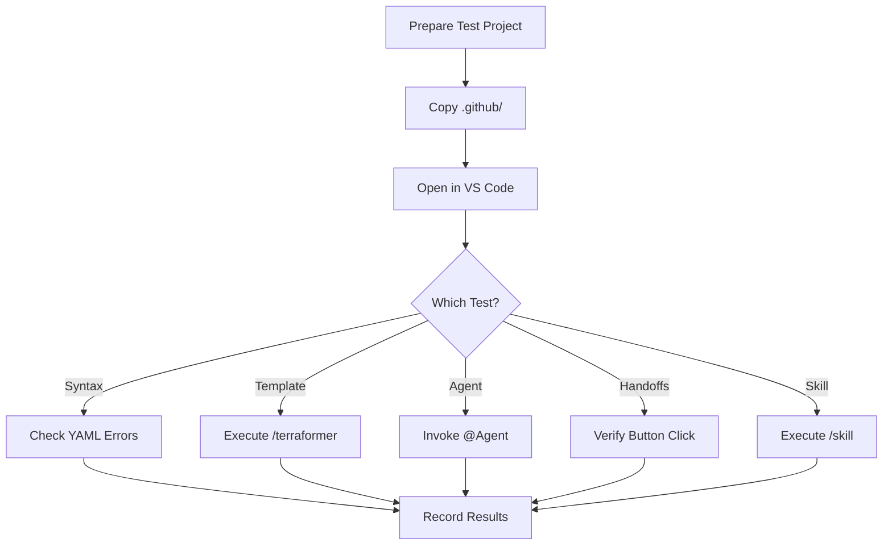

<!-- This document is generated and updated by .github/prompts/document-project.prompt.md -->

# Testing Strategy and Guide

## Project Characteristics

Terraformer is not a traditional "codebase" but a **collection of prompts and templates**. Therefore, traditional unit test, integration test, and E2E test paradigms do not directly apply.

### Test Targets

| Target           | Type                                 | Verification Method                |
| ---------------- | ------------------------------------ | ---------------------------------- |
| Prompt Files     | `/terraformer`, `/terraform-context` | Quality check of generated results |
| Agent Templates  | `*.agent.template.md`                | Verify generated agent behavior    |
| Skill Templates  | `*.prompt.template.md`               | Verify generated skill behavior    |
| YAML Frontmatter | All `.md` files                      | Syntax validation                  |

## Test Structure

```
terraformer/
├── .github/
│   ├── prompts/           # Test Target: Prompt Engine
│   └── templates/         # Test Target: Templates
│       ├── *.agent.template.md
│       └── skills/*.prompt.template.md
└── (test-project)/        # Create externally for verification
    └── .github/
        ├── agents/        # Generated Results
        └── prompts/       # Generated Results
```

## Types of Tests

### 1. Syntax Validation

**Purpose**: Verify validity of YAML frontmatter and Markdown syntax

**Verification Items**:

- [ ] YAML frontmatter is valid YAML syntax
- [ ] `name:` field exists and contains no spaces
- [ ] `description:` field exists
- [ ] Each item in `handoffs:` has `label:` and `agent:`

**Verification Method**:

```powershell
# Open Markdown file in VS Code and check for YAML warnings
# Or use any YAML linter
```

### 2. Template Expansion Test

**Purpose**: Verify that `{{TECH_STACK}}` placeholder is correctly replaced

**Verification Steps**:

1. Prepare test project (e.g., TypeScript + React)
2. Copy `.github/prompts/`, `.github/templates/`
3. Execute `/terraformer`
4. Verify no `{{TECH_STACK}}` remains in generated results
5. Verify tech stack is correctly reflected

**Verification Checklist**:

- [ ] `{{TECH_STACK}}` count is 0
- [ ] Agent descriptions contain correct technology names
- [ ] Skill descriptions contain correct technology names

### 3. Agent Behavior Test

**Purpose**: Verify that generated agents behave as expected

**Verification Scenarios for Each Agent**:

#### @Architect

| Scenario               | Expected Behavior                            |
| ---------------------- | -------------------------------------------- |
| Design Request         | Output design proposal with Mermaid diagrams |
| Ambiguous Requirements | Display Handoff button to `@BusinessAnalyst` |
| Design Complete        | Display Handoff button to `@Developer`       |

#### @Developer

| Scenario                | Expected Behavior                                  |
| ----------------------- | -------------------------------------------------- |
| Clear Specification     | Generate code following spec                       |
| Spec Gap                | **Stop immediately** and output escalation request |
| Prompted to Change Spec | **Refuse** and explain lack of authority           |

#### @BusinessAnalyst

| Scenario                | Expected Behavior                            |
| ----------------------- | -------------------------------------------- |
| Feature Request         | Organize in User Story format                |
| Code Generation Request | **Refuse** and explain they don't write code |

### 4. Handoffs Mechanism Test

**Purpose**: Verify that workflow transition buttons function correctly

**Verification Steps**:

1. Invoke `@Architect` and complete design
2. Verify "🚀 Start Implementation" button is displayed
3. Click the button
4. Verify context is passed to `@Developer`

**Note**: Handoffs behavior may vary depending on VS Code version.

### 5. Skill Execution Test

**Purpose**: Verify that generated skills behave as expected

| Skill       | Verification Scenario    | Expected Output                           |
| ----------- | ------------------------ | ----------------------------------------- |
| `/plan`     | Feature addition request | Affected files list, implementation steps |
| `/refactor` | Code improvement request | Refactoring plan, diff                    |
| `/test`     | Test generation request  | Test code (Happy Path + Edge Case)        |

## Test Execution Methods

### Manual Test Workflow



### Test Project Setup

```powershell
# 1. Create test directory
mkdir test-project
cd test-project

# 2. Create minimal project structure
echo "# Test Project`nTech Stack: TypeScript, React, Node.js" > README.md
mkdir src
echo "console.log('hello');" > src/index.ts

# 3. Copy Terraformer configuration
cp -r ../terraformer/.github/prompts ./.github/
cp -r ../terraformer/.github/templates ./.github/

# 4. Open in VS Code
code .
```

## Coverage Goals

| Test Type          | Goal                 | Current Status      |
| ------------------ | -------------------- | ------------------- |
| Syntax Validation  | 100%                 | Manual verification |
| Template Expansion | 100%                 | Manual verification |
| Agent Behavior     | Key scenarios        | Manual verification |
| Handoffs Mechanism | All transition paths | Manual verification |
| Skill Execution    | All skills           | Manual verification |

## Test Data Management

### Types of Test Projects

Prepare multiple test projects to verify behavior with different tech stacks:

| Project         | Tech Stack          | Verification Focus              |
| --------------- | ------------------- | ------------------------------- |
| test-typescript | TypeScript, Node.js | Basic operation                 |
| test-python     | Python, Django      | Different language support      |
| test-java       | Java, Spring Boot   | Enterprise use case             |
| test-minimal    | README.md only      | Minimal configuration operation |

## Testing Best Practices

### 1. Pre-verification Preparation

- [ ] Update VS Code to latest version
- [ ] Update GitHub Copilot Chat extension to latest version
- [ ] Delete previous generated results (test in clean state)

### 2. During Verification

- Test **one scenario at a time**
- **Record in detail** any deviations from expected behavior
- Save screenshots

### 3. Recording Results

```markdown
## Test Results - YYYY-MM-DD

### Environment

- VS Code: x.x.x
- GitHub Copilot Chat: x.x.x

### Syntax Validation

- [x] All YAML is valid

### Template Expansion

- [x] {{TECH_STACK}} correctly replaced
- Detected stack: TypeScript, React

### Agent Behavior

- [x] @Architect: As expected
- [ ] @Developer: Button not displayed during escalation (needs investigation)

### Notes

- ...
```

## Common Test Issues and Solutions

### Issue 1: Handoffs Buttons Not Displayed

**Symptom**: Handoffs buttons not displayed after agent output

**Possible Causes**:

- VS Code version is outdated
- Copilot Chat extension version is outdated
- YAML frontmatter syntax error

**Solutions**:

1. Update VS Code and Copilot Chat to latest versions
2. Validate YAML in `.agent.md` files
3. Try with VS Code Insiders edition

### Issue 2: `{{TECH_STACK}}` Not Replaced

**Symptom**: `{{TECH_STACK}}` remains in generated results

**Possible Causes**:

- No tech stack information in `README.md`
- Insufficient context for `/terraformer`

**Solutions**:

1. Add clear tech stack information to `README.md`
2. Execute with main source files open
3. Manually specify tech stack (add "This is a TypeScript project")

### Issue 3: Agent Not Behaving as Expected

**Symptom**: `@Developer` proposes spec changes

**Possible Causes**:

- Template constraints are weak
- Insufficient context

**Solutions**:

1. Strengthen "Iron Rules" section in template
2. Add additional rules to `copilot-instructions.md`
3. Report problematic scenario as an Issue

## Future Automation Plans

### Phase 1: CI Syntax Check

```yaml
# .github/workflows/lint.yml (Future Implementation)
name: Lint
on: [push, pull_request]
jobs:
  yaml-lint:
    runs-on: ubuntu-latest
    steps:
      - uses: actions/checkout@v4
      - name: Validate YAML frontmatter
        run: |
          # Custom script for YAML validation
```

### Phase 2: Automatic Verification of Generated Results

- Execute `/terraformer` equivalent processing in GitHub Actions
- Automatically verify structure of generated results
- Check for remaining `{{TECH_STACK}}`

### Phase 3: Automatic Agent Behavior Testing

- LLM-based test harness
- Detect differences from expected behavior
