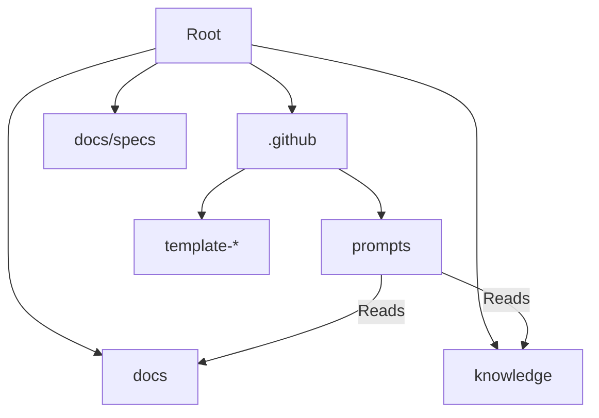

<!-- This document is generated/updated by the sync-doc workflow -->

# Directory Structure Guide

## Overall Configuration

Terraformer uses a specific directory structure to organize its components. Since it is a "Meta-Engine" installed into other projects, its structure is designed to be overlay-friendly.

```
terraformer/
├── .agent/                 # Antigravity specific definitions (Workflows, etc.)
├── .github/                # The Core Engine (Prompts, Templates)
│   ├── agents/             # Generated Agent Definitions (L4)
│   ├── prompts/            # Skill Definitions (L2)
│   └── template-*/         # Source templates for generating agents/skills
├── docs/                   # Project Documentation (L3) - Architecture, Specs, Context
├── knowledge/              # Universal Guidelines (not project-specific)
├── AGENTS.md               # The Constitution & Context Map Entry Point (L1)
└── README.md               # Project Introduction
```

## Responsibilities of Each Directory

### `/.github/prompts/`

- **Role**: Contains the "Skills" (SOPs) available to agents.
- **In Source Repo**: Contains only engine-core prompts (`terraformer.prompt.md`, `terraform-context.prompt.md`).
- **In Target Project**: Populated with all generated skills (`plan`, `debug`, etc.).
- **Dependencies**: These files are referenced by Copilot Custom Prompts (commands).

### `/.github/template-*/`

- **Role**: Stores the blueprints used by the `/terraformer` command to generate project-specific assets.
- **Key Files**: `template-agents/*.agent.template.md`, `template-skills/*.prompt.template.md`.
- **Note**: This directory is the "Source of Truth" for all skills. Improvements should be made here, not in `.github/prompts/` (which are generated).
- **Dependencies**: Used by the Terraformer meta-prompt.

### `/docs/`

- **Role**: Contains both high-level project documentation (Charter, ADRs) and specific context for Agents (Architecture, Guidelines).
- **Key Files**: `PROJECT_CHARTER.md`, `architecture/`, `rules/`
- **Dependencies**: Referenced by `AGENTS.md`.

### `/knowledge/`

- **Role**: A library of "Universal Knowledge" that applies across multiple projects. Contains best practices, prompting guides, and review checklists.
- **Key Files**: `guidelines/ai-literacy/README.md`, `guidelines/prompting/README.md`, `guidelines/software-review.md`, `workflows/workflow.md`.
- **Dependencies**: Can be symlinked or copied to other projects.

### `/docs/specs/`

- **Role**: Stores specific project specifications and artifacts (Requirements, Design, Plans).
- **Structure**: `docs/specs/[FeatureName]/`

## Module Dependency Diagram



## Layer Structure

1.  **Configuration Layer**: `.github/` - Defines HOW the system works.
2.  **Context Layer**: `docs/`, `AGENTS.md` - Defines WHAT the system works on.
3.  **Reference Layer**: `knowledge/`, `docs/` - Defines WHY and HOW-TO mechanisms.
