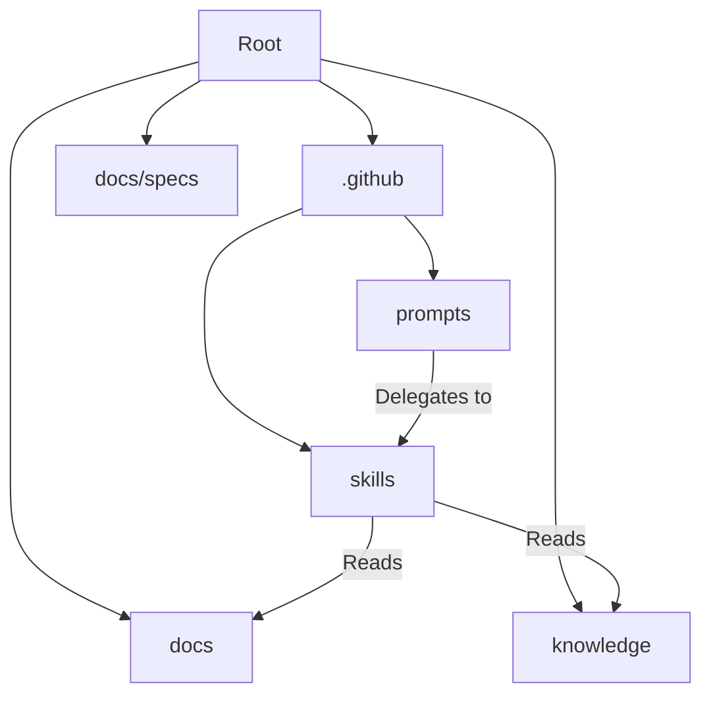

<!-- This document is generated/updated by the sync-doc workflow -->

# Directory Structure Guide

## Overall Configuration

Terraformer uses a specific directory structure to organize its components. Since it is a "Meta-Engine" installed into other projects, its structure is designed to be overlay-friendly.

```
terraformer/
├── .agent/                 # Antigravity specific definitions (Workflows, etc.)
├── .github/                # The Core Engine (Prompts, Agents, Skills)
│   ├── agents/             # Agent Definitions (L4)
│   ├── prompts/            # Command Definitions (L2 - Entry Points)
│   └── skills/             # Skill Definitions (L2 - Implementation Details)
├── docs/                   # Project Documentation (L3) - Architecture, Specs, Context
├── knowledge/              # Universal Guidelines (not project-specific)
├── AGENTS.md               # The Constitution & Context Map Entry Point (L1)
└── README.md               # Project Introduction
```

## Responsibilities of Each Directory

### `/.github/prompts/`

- **Role**: Contains the "Commands" (SOPs) available to agents. These are lightweight entry points that delegate to Skills.
- **In Source Repo**: Contains all command definitions including engine-core prompts.
- **In Target Project**: Populated with all generated commands (`arc-plan`, `dbg-debug`, etc.).
- **Dependencies**: These files reference corresponding Skills in `/.github/skills/`.

### `/.github/skills/`

- **Role**: Contains the detailed implementation (`SKILL.md`) files for each Command. Skills encapsulate the full logic, role requirements, and step-by-step instructions.
- **Structure**: Each skill has its own directory (e.g., `.github/skills/arc-implementation-planning/SKILL.md`).
- **Key Features**:
  - **Role-Based Access Control**: Skills can define `<stopping_rules>` to restrict execution to specific agents.
  - **Detailed Instructions**: Contains the full prompt engineering logic that would be too large for the entry-point prompt files.
- **Dependencies**: Referenced by the corresponding prompt files in `/.github/prompts/`.

### `/docs/`

- **Role**: Contains both high-level project documentation (Charter, ADRs) and specific context for Agents (Architecture, Guidelines).
- **Key Files**: `PROJECT_CHARTER.md`, `architecture/`, `rules/`
- **Dependencies**: Referenced by `AGENTS.md`.

### `/knowledge/`

- **Role**: A library of "Universal Knowledge" that applies across multiple projects. Contains best practices, prompting guides, and review checklists.
- **Key Files**: `guidelines/ai-literacy/README.md`, `guidelines/prompting/README.md`, `guidelines/software-review.md`, `workflows/workflow.md`.
- **Dependencies**: Can be symlinked or copied to other projects.

### `/docs/specs/`

- **Role**: Stores specific project specifications and artifacts (Requirements, Design, Plans).
- **Structure**: `docs/specs/[FeatureName]/`

## Module Dependency Diagram


```mermaid
graph TD
    Root[Root] --> Github[.github]
    Root --> Specs[docs/specs]
    Root --> Knowledge[knowledge]
    Root --> Docs[docs]

    Github --> Prompts[prompts]
    Github --> Skills[skills]

    Prompts -->|Delegates to| Skills
    Skills -->|Reads| Docs
    Skills -->|Reads| Knowledge
```

## Layer Structure

1.  **Configuration Layer**: `.github/` - Defines HOW the system works.
2.  **Context Layer**: `docs/`, `AGENTS.md` - Defines WHAT the system works on.
3.  **Reference Layer**: `knowledge/`, `docs/` - Defines WHY and HOW-TO mechanisms.
