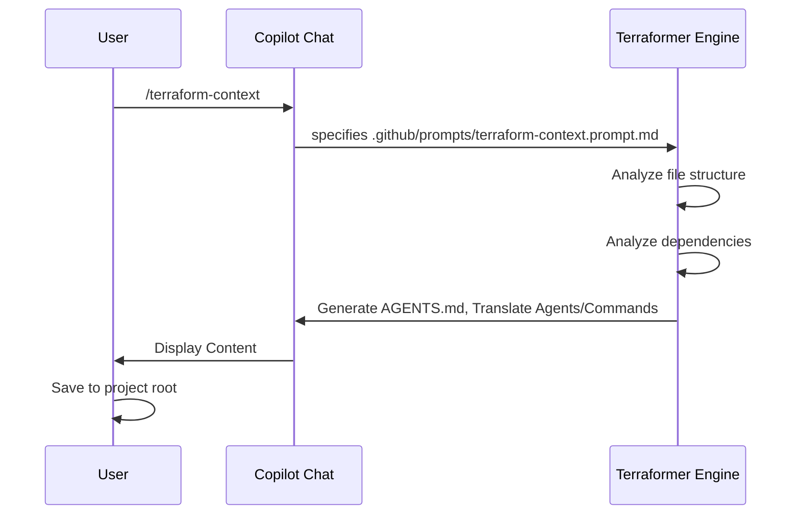

<!-- This document is generated/updated by the sync-doc workflow -->

# Key Feature Flows

## Entry Point

The entry point for any project using Terraformer is the generation of the Context Map.

## Flow 1: Context Map Generation (`/terraform-context`)

### Overview

Analyzes the existing project structure and generates `AGENTS.md` to serve as the "Constitution" and "Knowledge Hub" for the AI agents.

### Sequence Diagram

## Flow 2: AI Team Generation (Automatic)

### Overview

Based on the analysis, `/terraform-context` also helps setup and **translate** specialized AI agents (e.g., `@Architect`, `@Developer`) and their commands.

### Process Flow

1.  **Engine** analyzes the tech stack defined in the workspace.
2.  **Engine** identifies standard definitions.
3.  **Engine** translates (if necessary) and instructs User to check:
    - `.github/agents/*.agent.md` (Agent Definitions)
    - `.github/prompts/*.prompt.md` (Command Definitions)
4.  **User** saves these files along with `AGENTS.md`.

## Flow 3: Task Execution (The "Anti-Generalist" Flow)

### Overview

How a user interacts with the generated agents to build a feature.

### Related Files

- `.github/agents/Architect.agent.md`
- `.github/agents/Developer.agent.md`
- `.github/prompts/plan.prompt.md`

### Processing Flow

1.  **User** asks `@Architect` to "Plan feature X".
2.  **@Architect** uses `/plan` command to generate `implementation_plan.md`.
3.  **User** reviews and approves the plan.
4.  **User** asks `@Developer` to "Implement feature X based on the plan".
5.  **@Developer** reads the plan and implements code. _Note: Developer cannot change the plan._
6.  **User** asks `@QualityGuard` to "Review the changes".

## Flow 4: Release Management (`/release-new-version`)

### Overview

Standardized process for releasing a new version of the software.

### Processing Flow

1.  **User** runs `/release-new-version`.
2.  **Agent** analyzes `CHANGELOG.md` and git history.
3.  **Agent** proposes the next semantic version number (Major/Minor/Patch).
4.  **Agent** updates `CHANGELOG.md` and `package.json` (or equivalent).
5.  **Agent** creates a git tag and pushes changes.

## Flow 5: Specification Discovery (`/discover-specs`)

### Overview

Reverse-engineering specifications from existing code when documentation is missing or outdated.

### Processing Flow

1.  **User** runs `/discover-specs` on a specific feature or directory.
2.  **Agent** analyzes the source code to understand logic and behavior.
3.  **Agent** generates a `requirements.md` and `design.md` file in `docs/specs/[FeatureName]/`.
4.  **User** verifies the generated specs match the actual behavior.

## Flow 6: Documentation Maintenance

### Overview

Ensuring documentation stays in sync with the codebase.

### Commands

- **`/doc-sync`**: Updates the core architecture documentation (this file, `overview.md`, etc.).
- **`/check-doc-consistency`**: Verifies links and content consistency across `docs/` and `src/`.

### Processing Flow

1.  **User** runs `/doc-sync`.
2.  **Agent** analyzes the current project structure and agent configurations.
3.  **Agent** updates/creates files in `docs/architecture/` and `docs/rules/`.
4.  **User** reviews the changes and commits them.

## Flow 7: Quality Assurance

### Overview

Enforcing quality standards and ensuring no regressions.

### Commands

- **`/audit`**: Performs a comprehensive code review and security audit.
- **`/sanity-test`**: Generates a checklist to verify the system's health.
- **`/test-spec`**: Generates test cases from specification documents.

### Processing Flow

1.  **User** runs `/audit` on a file or PR.
2.  **@QualityGuard** reviews the code against `docs/rules/coding-conventions.md`.
3.  **@QualityGuard** provides a list of issues and improvement suggestions.

## Flow 8: Maintenance & Refactoring

### Overview

Safe refactoring and debugging of the system.

### Commands

- **`/refactor`**: Refactors code while maintaining behavior (requires existing tests).
- **`/debug`**: Analyzes errors and proposes fixes using "Root Cause Analysis".

## Flow 9: Extensibility

### Overview

Adding custom capabilities to the AI team.

### Commands

- **`/create-custom-prompt`**: Generates a new command tailored to project-specific needs.
- **`/create-custom-agent`**: Creates a new specialized agent role.

### Processing Flow

1.  **User** runs `/create-custom-prompt`.
2.  **Agent** asks for the goal and steps of the new command.
3.  **Agent** generates `.github/prompts/my-command.prompt.md`.
4.  **User** can now use `/my-command`.
