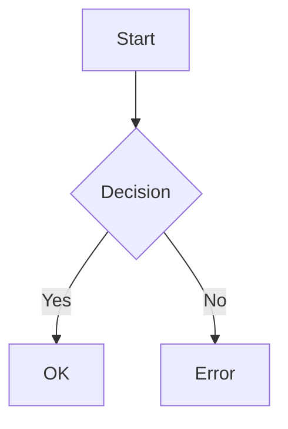

<!-- This document is generated by @Architect -->

# Specification: {{TITLE}}

<metadata>

| Metadata                | Value                        |
| :---------------------- | :--------------------------- |
| **Status**              | Draft / In Review / Approved |
| **Source Requirements** | [Link to Requirements]       |

</metadata>

<overview>

## 1. Overview

### Background

[Why is this change necessary? What problem does it solve?]

### Goals

[What are the specific objectives of this feature/change?]

### Scope

- **Included**:
  - [Item 1]
  - [Item 2]

- **Excluded**:
  - [Item 1]
  - [Item 2]

### Uncertainties & Open Questions

<!-- List items that need confirmation from the domain expert or product owner. -->

- [ ] [Question 1]
- [ ] [Question 2]

</overview>

<requirements>

## 2. Requirements

### User Stories

<!-- Rule: No technical terms (class names, DB columns) in User Stories. Focus on value. -->

- As a **[Role]**, I want to **[Action]**, so that **[Benefit]**.

### Acceptance Criteria (Gherkin)

<!-- Use explicit Gherkin syntax for behavioral specs. NO technical jargon. -->
<!-- Tip: Use 'Rule' keyword to group scenarios in complex logic (Guidelines Pattern A). -->
<gherkin>

```gherkin
Feature: [Feature Name]

Scenario: [Scenario Name]
Given [Precondition]
When [Action]
Then [Result]
```

</gherkin>
### Non-Functional Requirements

- **Performance**: [e.g., Latency < 200ms]
- **Security**: [e.g., Authentication required]
- **Reliability**: [e.g., 99.9% uptime]

</requirements>

<technical_design>

## 3. Technical Design

### Architecture / Flow

<!-- Use Mermaid for visual flows, especially for complex logic -->

<mermaid_diagram>



</mermaid_diagram>

### Logic Specifications

<logic_details>
[Detailed pseudo-code or additional Gherkin for complex logic. Use 'Rule' keywords if highly complex.]
</logic_details>

### Data Models

<data_definitions>
[Interface definitions, Schema changes]
interface Example {
id: string;
}
</data_definitions>

### API Changes

<api_definitions>
[New or modified endpoints]
</api_definitions>

</technical_design>

<verification_plan>

## 4. Verification Plan

### Automated Tests

[Test cases to be implemented. Reference Gherkin scenarios where possible.]

### Manual Verification

[Manual testing steps]
</verification_plan>
