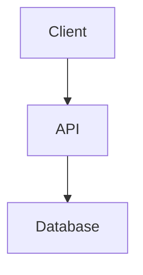

# Design Document: [Feature Name]

## 1. Overview

[High-level summary of the design]

## 2. Architecture Diagram (Mermaid)



## 3. Data Model

- **User**: `id`, `name`, `email`
- ...

## 4. API / Interface Definitions

```typescript
interface IService {
  doSomething(): void;
}
```

## 5. Key Decisions & Trade-offs

- Decision A vs B...
