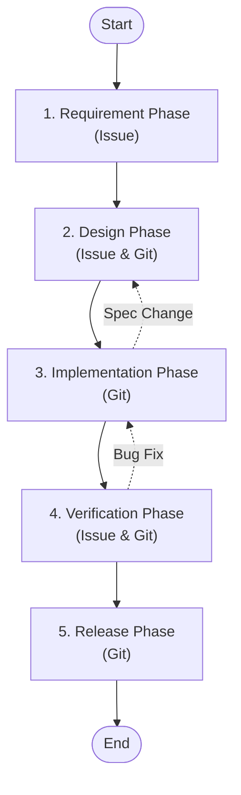

# Workflow (AI Collaborative Model)

This is a new workflow for collaboration between AI and human engineers.
In each phase, AI performs tasks such as "Proposing", "Drafting", "Implementing", and "Verifying", while humans focus on "Decision Making", "Reviewing", and "Final Approval".

## Overview

### Concepts

- **Process in Issue**: Records of discussions, decision-making processes, and considerations are kept in GitHub Issues.
- **Result in Git**: Final artifacts such as specifications, designs, code, and test results are managed in the Git repository.
- **AI as a Partner**: AI acts not just as a tool, but as a partner in pair programming.

## Phase Definitions

### 1. Requirement Phase

**Goal**: Clarify WHY we are doing this and WHAT problem we are solving.

- **AI Role**: **@BusinessAnalyst** (Skill: `/requirements`)
  - Organizing requirements, identifying unknowns, researching similar features, drafting user stories.
- **Human Role**: Presenting requirements, defining scope, judging business value.
- **Key Deliverables**:
  - [Requirement Definition Issue](./templates/issue_requirement.md) (Purpose, Context, Scope, Exit Criteria)
  - **Artifact**: `docs/specs/[FeatureName]/requirements.md`

### 2. Design Phase

**Goal**: Concretize HOW to achieve it and prevent rework.

- **AI Role**: **@Architect** (Skill: `/design`)
  - Drafting specifications, proposing architecture, defining interfaces.
- **Human Role**: Design decisions, security risk assessment, specification approval.
- **Key Deliverables**:
  - [Design Discussion Issue](./templates/issue_design.md)
  - **Artifact**: `docs/specs/[FeatureName]/design.md`
  - **Artifact**: `docs/specs/[FeatureName]/implementation_plan.md`

### 3. Implementation Phase

**Goal**: Create code that works as designed.

- **AI Role**:
  - **@Developer** (Skill: `/implement`)
    - Implementing code, creating unit tests, updating documentation, drafting commit messages.
  - **@Gardener** (Skill: `/refactor`)
    - Performing safe refactoring to improve code structure without changing behavior.
- **Human Role**: Code review, assisting with complex logic, directing AI.
- **Key Deliverables**:
  - Source Code, Test Code (Git)
  - Pull Request (Git)

### 4. Verification Phase (QA)

**Goal**: Guarantee quality and decide on release.

- **AI Role**: **@QualityGuard** (Skill: `/test-spec`, `/audit`)
  - **@Architect** (creating Test Cases)
  - **@Debugger** (Skill: `/debug`)
    - Analyzing bugs found during verification and proposing fixes.
  - Assisting test case execution, identifying bugs, and proposing fixes.
- **Human Role**: Exploratory testing, usability checks, release decision.
- **Key Deliverables**:
  - **Artifact**: `docs/specs/[FeatureName]/test-specs/*.md` (Test Specifications)
  - **Artifact**: `docs/specs/fixes/[IssueID]/fix-plan.md` (Bug Fix Plans)
  - [Sanity Test Result](./templates/test_sanity.md)
  - [Functional Test Result](./templates/test_functional.md)
  - [Exit Criteria Check Issue](./templates/issue_exit_criteria.md)

### 5. Release Phase

**Goal**: Deliver value to the user.

- **AI Role**: **@Librarian** (Skill: `/release-new-version`)
  - Generating CHANGELOG, creating release notes, automating tagging.
- **Human Role**: Final approval, pushing the release button (or approving).
- **Key Deliverables**:
  - Release Notes (GitHub Releases)
  - Tags (Git)

## Related Documents

- [Deliverables List](./deliverables.md)
- [Template List](./templates/)
