[← Back to Workflow](./workflow.md)

# Bug Fix Task Details

## Overview

Bug Fix Stories focus on explicitly "Reproduction" and "Prevention" to ensure bugs are fixed permanently and side effects are minimized.

## Task List

1. [Analyze & Plan](#1-analyze--plan)
2. [Create Reproduction Test](#2-create-reproduction-test)
3. [Implement Fix](#3-implement-fix)
4. [Verify Fix (Test)](#4-verify-fix-test)
5. [Verify Side Effects](#5-verify-side-effects)
6. [Update Documentation](#6-update-documentation)
7. [Verify Exit Criteria](#7-verify-exit-criteria)

---

### 1. Analyze & Plan

**Deliverable**: Bug Analysis Issue Comment / Plan

**Goal**: Identify the root cause and decide on a fix approach.

**Activities**:

- Analyze the reported bug.
- Reproduce the bug manually (if possible).
- Identify the root cause.
- Plan the fix.
  - **Template**: [Bug Fix Story](../templates/issues/story_bug_fix.md)
  - **Template**: [Bug Fix Plan](../templates/agents/bug_fix_plan.template.md) (Use this for detailed analysis)

**Checkpoints**:

- [ ] Root cause is identified.
- [ ] Reproduction steps are clear.
- [ ] Fix plan is feasible.
- [ ] Impact on other features is assessed.

**Dependencies**: None

---

### 2. Create Reproduction Test

**Deliverable**: Test Code (Git)

**Goal**: Automate reproduction to ensure the bug is fixed and never returns (Regression Testing).

**Activities**:

- Write a test case that fails because of the bug.
- Commit the failing test (Red state).

**Checkpoints**:

- [ ] Test case reproduces the bug (fails as expected).
- [ ] Test code is committed to Git.

**Dependencies**: 1. Analyze & Plan

---

### 3. Implement Fix

**Deliverable**: Source Code (Git)

**Goal**: Fix the bug.

**Activities**:

- Modify source code to fix the bug.
- Refactor if necessary (ensure safety).
  - **Template**: [Implementation Task](../templates/issues/task_implementation.md)

**Checkpoints**:

- [ ] Code is modified to fix the root cause.
- [ ] Coding standards are followed.

**Dependencies**: 2. Create Reproduction Test

---

### 4. Verify Fix (Test)

**Deliverable**: Test Result (Pass)

**Goal**: Confirm the bug is fixed using the reproduction test.

**Activities**:

- Run the reproduction test.
- Check if it passes (Green state).
  - **Template**: [Functional Test Task](../templates/issues/task_test_functional.md)

**Checkpoints**:

- [ ] Reproduction test passes.
- [ ] Other existing tests pass (No obvious regression).

**Dependencies**: 3. Implement Fix

---

### 5. Verify Side Effects

**Deliverable**: Side Effect Check Result (Issue Comment)

**Goal**: Ensure no other parts of the system are broken.

**Activities**:

- Run Sanity Tests (if critical/high impact).
- Run related feature tests.
- Manual exploratory testing around the affected area.

**Checkpoints**:

- [ ] No side effects observed.
- [ ] Sanity tests pass (if executed).

**Dependencies**: 4. Verify Fix (Test)

---

### 6. Update Documentation

**Deliverable**: Updated Documentation (Git)

**Goal**: Keep docs consistent with code behavior.

**Activities**:

- Update specs/design if the fix changed behavior/logic.
- Update CHANGELOG if necessary.
- Update TROUBLESHOOTING or KNOWN_ISSUES if relevant.

**Checkpoints**:

- [ ] Docs are updated to reflect the fix.
- [ ] CHANGELOG is updated.

**Dependencies**: 3. Implement Fix

---

### 7. Verify Exit Criteria

**Deliverable**: Verification Record on Project Management Tool

**Goal**: Confirm the bug fix story is complete.

**Activities**:

- Final check based on Exit Criteria.
  - **Template**: [Exit Criteria Template](../templates/issues/task_exit_criteria.md)
- Verify all deliverables are in Git.
- Close the issue.

**Checkpoints**:

- [ ] Bug is fixed and verified by tests.
- [ ] No degradations found.
- [ ] Documentation is updated.
- [ ] Ticket is closed.

**Dependencies**: 5. Verify Side Effects, 6. Update Documentation

---

## Task Flow Diagram

```mermaid
graph TD
    Start([Start]) --> T1
    T1["1. Analyze & Plan<br/>📄 Issue (Comment)"] --> T2
    T2["2. Create Reproduction Test<br/>💻 Git (Test)"] --> T3
    T3["3. Implement Fix<br/>💻 Git (Code)"] --> T4
    T4["4. Verify Fix (Test)<br/>📊 Issue (Result)"] --> T5
    T4 --> T6
    T5["5. Verify Side Effects<br/>👀 Issue (Result)"] --> T7
    T6["6. Update Documentation<br/>📚 Git (Docs)"] --> T7
    T7["7. Verify Exit Criteria<br/>✅ Issue (Record)"] --> End
    End([Resolved])

    classDef startEnd fill:#e1f5e1,stroke:#4caf50,stroke-width:2px,color:#000
    classDef task fill:#e3f2fd,stroke:#2196f3,stroke-width:2px,color:#000
    classDef check fill:#fff3e0,stroke:#ff9800,stroke-width:2px,color:#000

    class Start,End startEnd
    class T1,T2,T3,T6 task
    class T4,T5,T7 check
```

