[← Back to Workflow](./workflow.md)

# Feature Task Details

## Task List

1. [Spec Creation & Agreement](#1-spec-creation--agreement)
2. [Define Exit Criteria](#2-define-exit-criteria)
3. [Design](#3-design)
4. [Update Sanity Checklist](#4-update-sanity-checklist)
5. [Create Feature Checklist](#5-create-feature-checklist)
6. [Implementation & Tests](#6-implementation--tests)
7. [Run Sanity Tests](#7-run-sanity-tests)
8. [Run Feature Check](#8-run-feature-check)
9. [Verify Exit Criteria](#9-verify-exit-criteria)

---

### 1. Spec Creation & Agreement

**Deliverable**: Updated Specification (Git)

**Goal**: Clarify the requirements of the feature and form a common understanding within the team.

**Activities**:

- Clarify the purpose and background of the feature.
- Identify user stories and requirements.
- Create/Update specifications.
  - **Template**: [Specification Template](../templates/artifacts/specification.template.md)
- Reach agreement with the Product Owner.
- Manage specifications in Git.

**Checkpoints**:

- [ ] The purpose of the feature is clearly stated.
- [ ] User stories are defined.
- [ ] Non-functional requirements are included.
- [ ] Approved by the Product Owner.
- [ ] Specifications are committed to Git.

---

### 2. Define Exit Criteria

**Deliverable**: Exit Criteria Document (Issue/Project Management Tool)

- **Template**: [Define Exit Criteria](../templates/issues/task_define_exit_criteria.md)

**Goal**: Clarify the criteria for story completion and ensure quality.

**Activities**:

- Define completion criteria based on specifications.
- List validation items.
- Create Exit Criteria document.

**Mandatory Items**:

- [ ] Any spec changes after Exit Criteria creation must be reflected in subsequent check items.
- [ ] All specifications are finalized and agreed upon.
- [ ] Spec changes are reflected in Git documents.
- [ ] Design is based on specifications, and design changes are reflected in Git.
- [ ] Sanity test items are updated based on specifications.
- [ ] Feature verification items are created based on specifications.
- [ ] Changed sanity test items have been executed.

**Dependencies**: 1. Spec Creation & Agreement

---

### 3. Design

**Deliverable**: Updated Design Document (Git)

**Goal**: Clarify implementation direction and ensure quality and maintainability.

**Activities**:

- Technical design based on specifications.
- Architecture design.
- Interface design.
- Data model design.
- Design review.
- Team consensus.
- **Template**: [Design Template](../templates/artifacts/design.template.md)

**Important Notes**:

- If there are ambiguities or defects in the spec, **always confirm instead of guessing**.
- If spec revision or doc improvement is needed, **create a ticket**.

**Checkpoints**:

- [ ] All specifications are reflected in the design.
- [ ] Consistency with existing systems is confirmed.
- [ ] Performance impact is considered.
- [ ] Error handling is designed.
- [ ] Testability is considered.
- [ ] Reviewed by the team.
- [ ] Design documents are committed to Git.

**Dependencies**: 1. Spec Creation & Agreement

---

### 4. Update Sanity Checklist

**Deliverable**: Updated Sanity Test Items

**Goal**: Keep the checklist up-to-date for easy system-wide checks before release.

**Activities**:

- Add/Update check items based on spec/design.
- Review existing items (remove obsolete, modify content).
- Update the checklist file.
  - **Template**: [Sanity Checklist](../templates/artifacts/sanity_checklist.template.md)
  - **Issue Template**: [Update Sanity Checklist](../templates/issues/task_update_sanity_checklist.md)
- Commit to Git.

**Checkpoints**:

- [ ] Operation check items for the new feature are added.
- [ ] Items to check impact on existing features are included.
- [ ] Obsolete items due to changes are removed or updated.
- [ ] Check items match the latest app specifications.
- [ ] Checklist file is managed in Git.

**Dependencies**: 1. Spec Creation & Agreement, 3. Design

---

### 5. Create Feature Checklist

**Deliverable**: Feature Implementation Verification Items (Issue/PM Tool)

**Goal**: Clarify criteria to judge the completion of feature implementation.

**Activities**:

- Create check items based on spec/design.
  - **Template**: [Test Spec](../templates/artifacts/test_spec.template.md)
  - **Issue Template**: [Create Feature Checklist](../templates/issues/task_create_feature_checklist.md)
- Define normal and abnormal test cases.
- Define boundary value tests.

**Checkpoints**:

- [ ] There are check items corresponding to all spec items.
- [ ] Both normal and abnormal cases are covered.

**Dependencies**: 1. Spec Creation & Agreement, 3. Design

---

### 6. Implementation & Tests

**Deliverable**: Source Code, Test Code (Git)

**Goal**: Implement functionality based on design and ensure quality.

**Activities**:

- Implementation based on design.
- Creation of unit tests.
  - **Template**: [Implementation Task](../templates/issues/task_implementation.md)
- Code review.
- Continuous Integration.

**Implementation Principles**:

- **Large volume**: Split tickets appropriately.
- **Splitting tickets**: Consider introducing skeleton classes first.
- **Breaking changes**: Create a feature branch (never leave main branch in broken state).

**Checkpoints**:

- [ ] Implemented as designed.
- [ ] Follows coding standards.
- [ ] Unit tests are created.
- [ ] Test coverage meets criteria.
- [ ] Code review completed.
- [ ] CI passed.
- [ ] Source code committed to Git.

**Dependencies**: 3. Design

---

### 7. Run Sanity Tests

**Deliverable**: Sanity Test Results (Issue/PM Tool)

**Goal**: Perform a quick system-wide check to ensure no regression.

**Activities**:

- Operation check based on updated Sanity Checklist.
  - **Checklist**: [Sanity Checklist](../templates/artifacts/sanity_checklist.template.md)
- Record results (Ticket Comment).
  - **Template**: [Sanity Test Task](../templates/issues/task_test_sanity.md)

**Checkpoints**:

- [ ] All check items are executed.
- [ ] Results are recorded.
- [ ] Issues found are handled appropriately.
- [ ] Confirmation results are recorded on the ticket.

**Dependencies**: 4. Update Sanity Checklist, 6. Implementation & Tests

---

### 8. Run Feature Check

**Deliverable**: Feature Implementation Verification Results (Issue/PM Tool)

**Goal**: Confirm the completion of feature implementation.

**Activities**:

- Operation check based on created check items.
- Record results (Ticket Comment).
  - **Template**: [Functional Test Task](../templates/issues/task_test_functional.md)

**Checkpoints**:

- [ ] All check items are executed.
- [ ] Both normal and abnormal cases are checked.
- [ ] Results are recorded.
- [ ] Issues found are handled appropriately.
- [ ] Confirmation results are recorded on the ticket.

**Dependencies**: 5. Create Feature Checklist, 6. Implementation & Tests

---

### 9. Verify Exit Criteria

**Deliverable**: Verification Record on Project Management Tool

**Goal**: Confirm that the story meets the completion criteria.

**Activities**:

- Final check based on Exit Criteria document.
  - **Template**: [Verify Exit Criteria](../templates/issues/task_verify_exit_criteria.md)
- Verification of all deliverables.
- Record confirmation results as a comment on the ticket.

**Checkpoints**:

- [ ] All Exit Criteria items are verified.
- [ ] Git-managed deliverables (code, specs, design, etc.) exist on Git.
- [ ] Documentation is updated to the latest state.
- [ ] Team approval obtained.
- [ ] Confirmation completion recorded on the ticket.

**Dependencies**: 2. Define Exit Criteria, 7. Run Sanity Tests, 8. Run Feature Check

---

## Task Flow Diagram

```mermaid
graph TD
    Start([Start]) --> T1
    T1["1. Spec Creation & Agreement<br/>📄 Spec"] --> T2
    T1 --> T3
    T2["2. Define Exit Criteria<br/>📋 Exit Criteria"] --> T9
    T3["3. Design<br/>📐 Design Doc"] --> T4
    T3 --> T5
    T3 --> T6
    T1 --> T4
    T1 --> T5
    T4["4. Update Sanity Checklist<br/>📋 Updated Checklist"] --> T7
    T5["5. Create Feature Checklist<br/>✓ Check Items"] --> T8
    T6["6. Implementation & Tests<br/>💻 Code & Tests"] --> T7
    T6 --> T8
    T7["7. Run Sanity Tests<br/>📊 Result"] --> T9
    T8["8. Run Feature Check<br/>📊 Result"] --> T9
    T9["9. Verify Exit Criteria<br/>✅ Record on Ticket"] --> End
    End([Completed])

    classDef startEnd fill:#e1f5e1,stroke:#4caf50,stroke-width:2px,color:#000
    classDef task fill:#e3f2fd,stroke:#2196f3,stroke-width:2px,color:#000
    classDef check fill:#fff3e0,stroke:#ff9800,stroke-width:2px,color:#000

    class Start,End startEnd
    class T1,T2,T3,T4,T5,T6 task
    class T7,T8,T9 check
```

