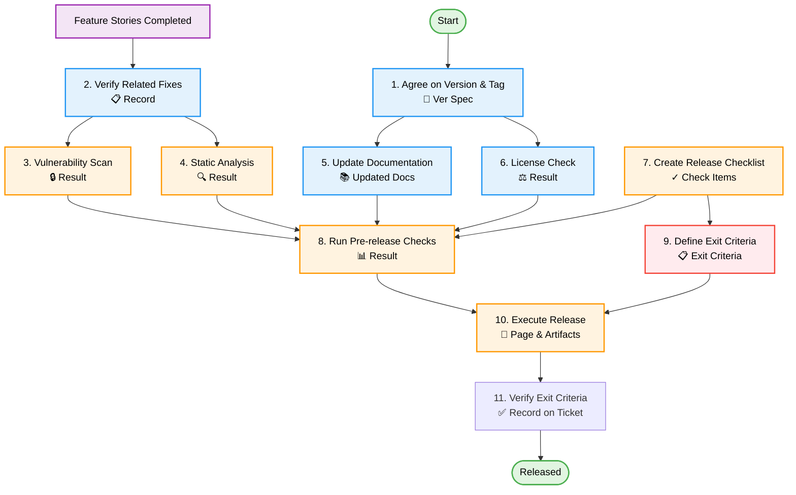

[← Back to Workflow](./workflow.md)

# Release Task Details

## Overview

Create a Release Story when releasing the application.
Bug fixes and small tasks that shouldn't be individual stories are linked to the Release Story.

## Task List

1. [Agree on Version & Tag Name](#1-agree-on-version--tag-name)
2. [Verify Related Fixes](#2-verify-related-fixes)
3. [Vulnerability Check](#3-vulnerability-check)
4. [Static Analysis](#4-static-analysis)
5. [Update Documentation](#5-update-documentation)
6. [License Check](#6-license-check)
7. [Create Release Checklist](#7-create-release-checklist)
8. [Run Pre-release Checks](#8-run-pre-release-checks)
9. [Define Exit Criteria](#9-define-exit-criteria)
10. [Execute Release](#10-execute-release)
11. [Verify Exit Criteria](#11-verify-exit-criteria)

---

### 1. Agree on Version & Tag Name

**Deliverable**: Agreement record on Project Management Tool

**Goal**: Clarify release version naming rules and content.

**Activities**:

- Version decision based on Semantic Versioning (SemVer).
- Git Tag name decision.
- Draft Release Notes core content.
- Record agreement on ticket.
  - **Template**: [Release Version Agreement](../templates/issues/task_version_agreement.md)

**Checkpoints**:

- [ ] Version number follows SemVer.
- [ ] Tag name follows naming convention.
- [ ] Team agreement obtained.
- [ ] Agreement recorded on ticket.

**Dependencies**: None

---

### 2. Verify Related Fixes

**Deliverable**: Confirmation result on Project Management Tool

**Goal**: Ensure all changes linked to the Release Story are included.

**Activities**:

- Check bug fixes linked to Release Story.
- Check feature additions/changes linked to Release Story.
- Check for merge omissions.
- Confirm conflict resolution.
- Record confirmation results on ticket.
  - **Template**: [Verify Related Fixes](../templates/issues/task_verify_related_fixes.md)

**Checkpoints**:

- [ ] All related tickets are closed.
- [ ] All PRs are merged.
- [ ] Branch conflicts are resolved.
- [ ] Confirmation results recorded on ticket.

**Dependencies**: Completion of each feature story

---

### 3. Vulnerability Check

**Deliverable**: Vulnerability Check Result (Git)

**Goal**: Identify and address security risks.

**Activities**:

- Vulnerability scan of dependency libraries.
  - Python: `pip-audit` or `safety`
  - Node.js: `npm audit` or `yarn audit`
- Check against known vulnerability databases.
- Handle found vulnerabilities.
  - Critical/High: Must fix.
  - Medium: Evaluate risk and decide.
  - Low: Record and consider for future.
- **Template**: [Vulnerability Check Task](../templates/issues/task_vulnerability_check.md)

**Checkpoints**:

- [ ] All dependencies scanned.
- [ ] Critical/High vulnerabilities addressed.
- [ ] Risk evaluation for remaining vulnerabilities recorded.
- [ ] Check results recorded on ticket.

**Dependencies**: 2. Verify Related Fixes

---

### 4. Static Analysis

**Deliverable**: Static Analysis Result (Project Management Tool)

**Goal**: Detect potential bugs and quality issues via static analysis.

**Activities**:

- Run static analysis tools.
- Analyze detected issues.
- Fix high-priority issues.
- Determine and record False Positives.
- Record check results on ticket.
  - **Template**: [Static Analysis Task](../templates/issues/task_static_analysis.md)

**Checkpoints**:

- [ ] Static analysis executed.
- [ ] Critical issues addressed.
- [ ] Reasons for not addressing issues recorded.
- [ ] Results recorded on ticket.

**Dependencies**: 2. Verify Related Fixes

---

### 5. Update Documentation

**Deliverable**: Updated Documentation (Git)

- **Template**: [Update Documentation](../templates/issues/task_docs_update.md)

**Goal**: Ensure users and developers have access to the latest info.

**Activities**:

- Update README.md.
- Update CHANGELOG.md or change history.
- Update HowToUse/Tutorials.
- Update API Specs (if applicable).
- Update Dependency List.

**Checkpoints**:

- [ ] README.md updated.
- [ ] CHANGELOG.md updated.
- [ ] Version number consistent across all docs.
- [ ] Breaking changes clearly noted.
- [ ] Documents committed to Git.

**Dependencies**: 1. Agree on Version & Tag Name

---

### 6. License Check

**Deliverable**: License List File (Git), Confirmation Result (PM Tool)

**Goal**: Ensure library licenses are appropriate and avoid legal risks.

**Activities**:

- Retrieve license list of dependencies.
- Update license list file.
- Commit to Git.
- Check license types.
- Identify and handle problematic licenses.
- Update license notices.
- Record confirmation results on ticket.
  - **Template**: [License Check Task](../templates/issues/task_license_check.md)

**Checkpoints**:

- [ ] License list file updated.
- [ ] License list file committed to Git.
- [ ] All dependency licenses checked.
- [ ] No issues with commercial use licenses.
- [ ] Confirmation results recorded on ticket.

**Dependencies**: 2. Verify Related Fixes

---

### 7. Create Release Checklist

**Deliverable**: Check items on Project Management Tool

**Goal**: Clarify final check criteria before release.

**Activities**:

- Record release check items on ticket. Includes:
  - Operation Check (Feature verification linked to release).
  - Quality/Security (Vulnerability, Static Analysis, License).
  - Documents (README updates, etc.).
  - Release Artifacts (Build output, etc.).
  - Version Control (Tags, Commits).
- **Template**: [Release Checklist](../templates/issues/task_release_checklist.md)

**Checkpoints**:

- [ ] All check items covered.
- [ ] Check items are specific and executable.
- [ ] Check items recorded on ticket.

**Dependencies**: 1. Agree on Version & Tag Name

---

### 8. Run Pre-release Checks

**Deliverable**: Confirmation result on Project Management Tool

**Goal**: Confirm release criteria are met.

**Activities**:

- Execute checks based on items created in 7.
- Record results for each item.
- Handle discovered issues.
- Record confirmation results on ticket.

**Checkpoints**:

- [ ] All check items executed.
- [ ] All check items passed.
- [ ] Issues handled appropriately.
- [ ] Confirmation results recorded on ticket.

**Dependencies**: 3. Vulnerability Check, 4. Static Analysis, 5. Update Documentation, 6. License Check, 7. Create Release Checklist

---

### 9. Define Exit Criteria

**Deliverable**: Exit Criteria Document (Issue/PM Tool)

- **Template**: [Define Exit Criteria](../templates/issues/task_define_exit_criteria.md)

**Goal**: Clarify criteria for release completion.

**Mandatory Items**:

- [ ] Pre-release checks executed and passed.
- [ ] Release completed.
  - [ ] Release page created.
  - [ ] Release announcement sent.
  - [ ] Git Tag created.
  - [ ] Release artifacts published.

**Checkpoints**:

- [ ] Exit Criteria fully listed.
- [ ] Exit Criteria recorded on ticket.

**Dependencies**: 7. Create Release Checklist

---

### 10. Execute Release

**Deliverable**: Release Page, Release Artifacts

**Goal**: Officially release the new version.

**Activities**:

- Create Git Tag.
- **Template**: [Execute Release](../templates/issues/task_release_execution.md)
- Create GitHub Release Page.
- Publish to Package Registry (if applicable).
- Send release announcement.

**Checkpoints**:

- [ ] Git Tag created and pushed.
- [ ] GitHub Release Page created.
- [ ] Release notes written.
- [ ] Artifacts uploaded.
- [ ] Published to package registry (if applicable).
- [ ] Release announcement sent.

**Dependencies**: 8. Run Pre-release Checks, 9. Define Exit Criteria

---

### 11. Verify Exit Criteria

**Deliverable**: Confirmation result on Project Management Tool

**Goal**: Confirm Release Story meets completion criteria.

**Activities**:

- Final check based on Exit Criteria.
- **Template**: [Verify Exit Criteria](../templates/issues/task_verify_exit_criteria.md)
- Verification of all deliverables.
- Record confirmation results as comment on ticket.

**Checkpoints**:

- [ ] All Exit Criteria items verified.
- [ ] Release page verified public.
- [ ] Release announcement verified sent.
- [ ] All docs verified up-to-date.
- [ ] Team approval obtained.
- [ ] Confirmation completion recorded on ticket.

**Dependencies**: 10. Execute Release

---

## Task Flow Diagram

